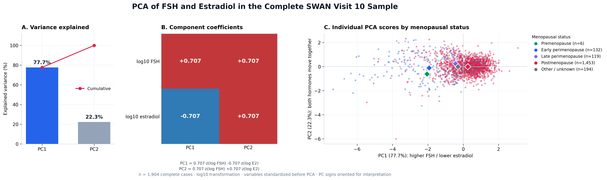
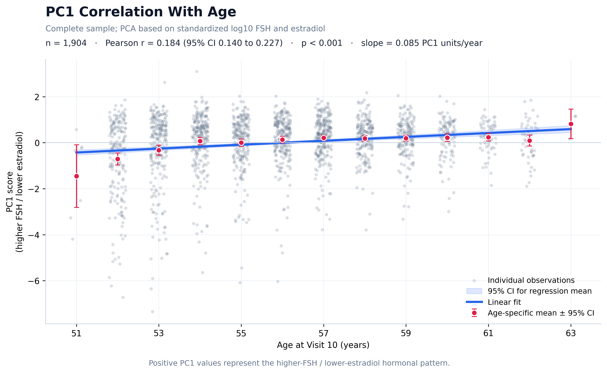
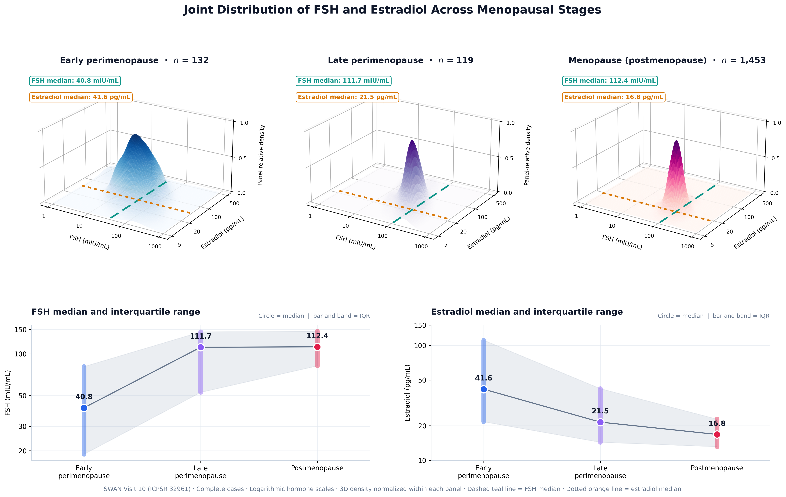

# Introduction

The study will recruit **Cohort 1**: $60$ women aged 40--55 across the menopausal transition, characterized with serum FSH and 17$\beta$-estradiol, structural MRI (cortical thickness, DKT atlas), DWI, and EEG; and **Cohort 2**: $60$ women aged 60--75 ($30$ with MCI, $30$ cognitively healthy controls). The central Cohort-1 hypothesis is that inter-individual differences in the hormonal challenge of the transition, summarized by the first principal component (PC1) of $\log_{10}$ FSH and $\log_{10}$ estradiol, are expressed in the brain's principal modes of structural variation, over and above age. Because all Cohort-1 participants are women, sex is constant and does not enter the model; age is the covariate, following the laboratory's standard modelling practice.

This version determines the required sample size under the laboratory's *actual analysis pipeline*: a hierarchical Bayesian Lasso regression (the JAGS `model_string_Lasso`) in which the hormonal PC1 is regressed on the full set of brain principal components plus age, mirroring how the group regresses outcomes on ICA/PCA brain components with covariates. The design question is: *what sample size $n$ yields, with probability $\ge0.80$, that at least one brain principal component is significant on the hormonal PC1, in a two-sided sense (its $95\%$ credible interval excludes zero)?* Section 2 describes the calibration data, the generative model, the analysis model and detection criterion, and the simulation scenarios; Section 3 reports the required $n$ for both cohorts; Section 4 states the conclusions.

# Methods

## Calibration data

**Hormonal predictor (SWAN Visit 10).** PC1 was computed exactly as in the laboratory's pipeline: $\log_{10}$ transformation of FSH and estradiol, standardization, and PCA ($n=1{,}904$ complete cases with both hormones $>0$). PC1 explains $77.7\%$ of the variance with loadings $+0.707\,z(\log \mathrm{FSH})\; -0.707\,z(\log \mathrm{E2})$ (Figure [1](#fig:pca){reference-type="ref" reference="fig:pca"}), and correlates with age ($r=0.184$ overall, $r\approx0.17$ within the early-perimenopausal pool; Figure [2](#fig:age){reference-type="ref" reference="fig:age"}). Table [1](#tab:stages){reference-type="ref" reference="tab:stages"} summarizes the hormonal landscape by STRAW+10 stage and Figure [3](#fig:joint){reference-type="ref" reference="fig:joint"} the joint FSH--estradiol distributions; early perimenopause shows the broadest joint density and the largest PC1 dispersion (SD $=1.90$), the hormonal variability that the study exploits as a natural stress test.

::: {#tab:stages}
| Stage               |   $n$ |      PC1 mean (SD) |    FSH median \[IQR\] |    E2 median \[IQR\] |     |
|:--------------------|------:|-------------------:|----------------------:|---------------------:|----:|
| Premenopause        |     6 |     $-2.05$ (1.19) |   29.9 \[19.1, 39.7\] |  37.9 \[20.4, 68.9\] |     |
| Early perimenopause |   132 | $-1.93$ (**1.90**) |   40.8 \[18.9, 81.0\] | 41.6 \[21.7, 111.1\] |     |
| Late perimenopause  |   119 |     $-0.44$ (1.59) | 111.7 \[52.8, 144.3\] |  21.5 \[14.4, 42.1\] |     |
| Postmenopause       | 1,453 |     $+0.26$ (0.88) | 112.4 \[82.0, 145.6\] |  16.8 \[13.2, 22.9\] |     |

: Hormonal landscape by STRAW+10 stage, SWAN Visit 10 (complete cases).
:::

{#fig:pca width="100%"}

{#fig:age width="86%"}

{#fig:joint width="100%"}

**Brain components (DKT cortical thickness).** The brain side of the simulation was calibrated from the laboratory's DKT-atlas cortical-thickness data restricted to the 40--55-year window ($54$ participants $\times$ 62 ROIs). A PCA of the standardized ROI matrix gives: PC1 $=60.4\%$ of the variance (global thickness), components 1--10 $=86.8\%$, components 1--20 $=94.7\%$; the first brain component correlates with age at $r=-0.171$ in this window. The primary number of components retained in the simulation is $K=20$, matching the laboratory's ICA default (`n_comp = 20` in `run_stable_aligned_ICA`); sensitivity analyses use $K=14$ (the smallest $K$ jointly explaining $90\%$ of the variance, $90.8\%$), $K=10$ ($86.8\%$), and $K=5$ ($78.1\%$).

## Generative model (Cohort 1)

For each simulated participant $i=1,\dots,n$, with standardized age $a_i\sim\mathcal{N}(0,1)$: $$\begin{aligned}
\mathrm{PCb}_{i1} &= c_b\, a_i + \sqrt{1-c_b^{2}}\;e_{i1}, \qquad c_b=-0.17
\quad\text{(global-thickness component, age-related)},\nonumber\\
\mathrm{PCb}_{ij} &\sim \mathcal{N}(0,1) \quad j=2,\dots,K
\quad\text{(orthogonal standardized brain components)},\\[2pt]
y_i &= c_y\, a_i \;+\; \textstyle\sum_{j\in\mathcal{T}} \rho\,\mathrm{PCb}_{ij}
\;+\; \sqrt{1-c_y^{2}-|\mathcal{T}|\rho^{2}}\;\varepsilon_i,
\qquad c_y=+0.17,\ \varepsilon_i\sim\mathcal{N}(0,1),

\end{aligned}$$ where $y$ is the standardized hormonal PC1, $c_y$ is its age correlation in the SWAN early-perimenopausal pool, and $\mathcal{T}$ indexes the truly associated brain component(s) with standardized effect $\rho$ each. The true components are deliberately *not* the age-related first component, so that the hormonal association is not confounded with age; the design parameter is $\rho$, the standardized coefficient of each true component. Scenarios: one true component with $\rho\in\{0.2,0.3,0.4,0.5\}$; two true components with $\rho=0.3$ each; and the global null ($\rho=0$).

## Analysis model and detection criterion

Each simulated dataset is analysed with the laboratory's hierarchical Bayesian Lasso (JAGS `model_string_Lasso`; [@park2008]), with $y$ = hormonal PC1 and design matrix $\mathbf{x}_i=[\mathrm{PCb}_{i1},\dots,\mathrm{PCb}_{iK},\,a_i]$ (all $p=K{+}1$ predictors penalized, as in the laboratory's models): $$y_i \sim \mathcal{N}\!\bigl(\beta_0 + \mathbf{x}_i^{\top}\boldsymbol\beta,\ \sigma^2\bigr),\quad
\beta_0\sim\mathcal{N}(0,10^2),\quad \sigma^2\sim\text{Inv-Gamma}(0.01,0.01),$$ $$\beta_j\mid\sigma^2,\tau_j^2 \sim \mathcal{N}(0,\sigma^2\tau_j^2),\quad
\tau_j^2\sim\text{Exp}(\lambda^2/2)
\;\Longrightarrow\; \beta_j\mid\sigma^2 \sim \text{Laplace}(0,\sigma/\lambda),$$ with the laboratory's empirical rule $\lambda = p\,\sqrt{\widehat{\mathrm{Var}}(\text{OLS residuals})}\big/\sum_j|\hat\beta_j^{\mathrm{OLS}}|$ computed per dataset.

**Detection criterion (two-sided).** A brain component $j$ is declared significant when its equal-tailed $95\%$ credible interval excludes zero, in either direction; equivalently, $P(\beta_j>0\mid\text{data})>0.975$ or $<0.025$. A simulated study is a *success* when **at least one** of the $K$ brain components is significant. The required sample size is $$n^{*} \;=\; \min\bigl\{\,n:\ P(\text{$\ge1$ brain component significant}\mid\rho)\ \ge\ 0.80\,\bigr\},$$ and under the global null the same quantity $P(\ge1\text{ significant}\mid\rho=0)$ is the family-wise false-detection rate of the pipeline, which we report alongside.

**Posterior standardized $\beta$.** Beyond the binary detection criterion, we also evaluate the quantity that is reported in practice: the posterior standardized regression coefficient $\beta$ of the associated brain component. Because both the response and the components are standardized and the components are mutually orthogonal, the population coefficient of the truly associated component equals the target effect ($\beta_{\mathrm{true}}=\rho$), so the simulation directly measures how well the pipeline recovers it. For every simulated study we record the posterior mean of $\beta$, its equal-tailed $95\%$ credible interval, the shrinkage factor $\mathbb{E}[\beta\mid\text{data}]/\beta_{\mathrm{true}}$ induced by the Lasso prior, whether the interval covers the true value, and whether the component with the largest posterior $|\beta|$ among the $K$ is the truly associated one. These scenarios use $1{,}200$ simulated studies each, and the credible intervals are computed from the retained posterior draws (the interval criterion and the tail-probability criterion agree on all but $0.5\%$ of datasets, which sit exactly at the boundary).

**Bayes-factor thresholds.** In addition to the credible-interval criterion, evidence per component is quantified with the default JZS Bayes factor applied to the partial correlation of each brain component with $y$, controlling for the remaining components and age ([@wetzels2012], with $m=n-K$); this criterion is also two-sided. A study is a success at threshold $u$ when at least one brain component reaches $\mathrm{BF}_{H_1/H_0}>u$, with $u\in\{4,6,10\}$. Because this Bayes factor is analytic and monotone in the squared partial correlation, these scenarios use $4{,}000$ datasets per cell with no MCMC.

**Computation and verification.** The Gibbs sampler is exact (conjugate updates identical to JAGS) and vectorized so that all simulated datasets advance in parallel; each cell uses $400$ datasets and $3{,}000$ iterations ($800$ burn-in). The batched sampler was verified against an independent scalar reference implementation of the same model on identical data (maximum discrepancy in $P(\beta_j>0)$ of $0.010$, within Monte Carlo error); the scalar sampler had itself been cross-validated against analytic Bayes factors via Savage--Dickey ratios.

## Cohort 2 under the same logic (MCI vs. HC, with the hormonal component)

Cohort 2 follows the same multivariate logic as Cohort 1. The group indicator is regressed, with the same Bayesian Lasso and priors, on the full design $\mathbf{x}_i=[\mathrm{PCb}_{i1},\dots,\mathrm{PCb}_{i,20},\ \mathrm{hPC1}_i,\ a_i]$, so the model *includes the hormonal component* alongside the brain components and age. The generative model uses balanced, age-matched groups ($g_i=\pm\tfrac12$, age $\perp$ group, as in the study design); one truly discriminating brain component carries an MCI--HC separation of Cohen's $d\in\{0.5, 0.65, 0.8, 1.0\}$ (components standardized to unit marginal variance); and the hormonal PC1 is calibrated on the SWAN *postmenopausal* pool, where its age correlation is essentially zero ($r=-0.015$, $n=1{,}453$), with an optional MCI--HC hormonal separation $d_h\in\{0, 0.3\}$. The success criterion is identical to Cohort 1: at least one *brain* component whose $95\%$ credible interval excludes zero, two-sided; the probability that the hormonal coefficient itself is significant is tracked separately. As a complementary benchmark we retain the classical group-contrast design analysis (two-sample JZS Bayes factor, Rouder et al. [@rouder2009], exact power via the non-central $t$).

# Results

## Cohort 1: required $n$ under the Lasso criterion

Table [2](#tab:nreq){reference-type="ref" reference="tab:nreq"} reports the required $n$ for every scenario, and Table [3](#tab:opera){reference-type="ref" reference="tab:opera"} the operating characteristics at the proposed $n=60$ and at $n=72$. Figure [4](#fig:lasso){reference-type="ref" reference="fig:lasso"} shows the detection curves, the family-wise false-detection rate under the global null, the sensitivity to $K$, and the two-true-components scenario.

::: {#tab:nreq}
| Scenario                  | True effect     | Required $n$ |
|:--------------------------|:----------------|-------------:|
| $K=20$ components, 1 true | $\rho=0.2$      |         n.a. |
| $K=20$ components, 1 true | $\rho=0.3$      |      **134** |
| $K=20$ components, 1 true | $\rho=0.4$      |       **72** |
| $K=20$ components, 1 true | $\rho=0.5$      |           42 |
| $K=10$ components, 1 true | $\rho=0.3$      |          128 |
| $K=10$ components, 1 true | $\rho=0.4$      |           69 |
| $K=20$ components, 2 true | $\rho=0.3$ each |       **75** |

: Required $n$ for $P(\ge1$ brain component significant$)\ge0.80$ under the Bayesian-Lasso criterion (two-sided $95\%$ CrI). "n.a." = not attainable with $n\le160$.
:::

::: {#tab:opera}
|                               |                             $n=60$ |       |    $n=72$ |       |
|:-----------------------------:|-----------------------------------:|------:|----------:|------:|
| True effect $\rho$ |                                any |  true |       any |  true |
|              0.2              |                              0.308 | 0.140 |     0.320 | 0.175 |
|              0.3              |                              0.493 | 0.368 |     0.535 | 0.458 |
|              0.4              |                              0.745 | 0.695 | **0.803** | 0.758 |
|              0.5              |                          **0.935** | 0.930 | **0.945** | 0.945 |
|       $0$ (global null)       | family-wise false detection: 0.188 |       |     0.180 |       |

: Operating characteristics at $n=60$ and $n=72$ ($K=20$, one true component; $400$ simulated datasets per cell). "Any" = probability that at least one brain component is significant (the design criterion); "true" = probability that the truly associated component is among them.
:::

Four findings summarize the analysis. First, under the laboratory's own criterion the proposed $n=60$ reaches a detection probability of $0.745$ for a single associated component of $\rho=0.4$ and $0.935$ for $\rho=0.5$; the $0.80$ target at $\rho=0.4$ is attained at $n^{*}=72$, and $\rho=0.5$ requires only $n^{*}=42$. Second, a moderate single-component effect of $\rho=0.3$ requires $n^{*}=134$, and $\rho=0.2$ is not attainable within $n\le160$; however, if the hormonal signal is expressed in *two* brain components of $\rho=0.3$ each, a biologically plausible scenario for distributed effects, the requirement drops to $n^{*}=75$ ($0.73$ at $n=60$, $0.79$ at $n=72$). Third, the family-wise false-detection rate of the criterion under the global null is non-trivial because twenty components are tested jointly: it ranges from $0.24$ at $n=40$ to $0.13$--$0.18$ for $n\ge60$ ($0.188$ at $n=60$), with on average $0.2$ falsely selected components per dataset; accordingly, Table [3](#tab:opera){reference-type="ref" reference="tab:opera"} also reports the probability that the *true* component is detected, and Section 4 recommends the stability checks that should accompany any single-component claim. Fourth, the results are robust to the number of retained components (Table [5](#tab:ksens){reference-type="ref" reference="tab:ksens"}): across $K\in\{5,10,14,20\}$ the required $n$ spans only $66$--$72$ at $\rho=0.4$ and $121$--$134$ at $\rho=0.3$, while the family-wise false-detection rate falls sharply with fewer components (from $0.180$ at $K=20$ to $0.052$ at $K=5$, at $n=72$), an argument for prespecifying a reduced component set when possible.

{#fig:lasso width="100%"}

## Posterior standardized $\beta$ of the associated component

::: {#tab:beta}
| $n$ | True $\beta$ | Posterior $\beta$ | Shrinkage |   Median 95% CrI | CrI width | Coverage | Selects true |
|:---:|:------------:|------------------:|----------:|-----------------:|----------:|---------:|-------------:|
| 60  |     0.30     |             0.194 |      0.65 | $[-0.02,\ 0.42]$ |      0.43 |     0.82 |         0.56 |
| 72  |     0.30     |             0.196 |      0.65 | $[-0.01,\ 0.40]$ |      0.40 |     0.79 |         0.63 |
| 100 |     0.30     |             0.209 |      0.70 |  $[0.02,\ 0.39]$ |      0.35 |     0.82 |         0.78 |
| 134 |     0.30     |             0.219 |      0.73 |  $[0.05,\ 0.38]$ |      0.32 |     0.80 |         0.89 |
| 60  |     0.40     |             0.284 |      0.71 |  $[0.04,\ 0.51]$ |      0.45 |     0.80 |         0.80 |
| 72  |     0.40     |             0.298 |      0.74 |  $[0.08,\ 0.51]$ |      0.42 |     0.82 |         0.89 |
| 60  |     0.50     |             0.389 |      0.78 |  $[0.16,\ 0.62]$ |      0.45 |     0.81 |         0.95 |

: Recovery of the posterior standardized $\beta$ of the truly associated brain component ($K=20$ components plus age; $1{,}200$ simulated studies per scenario). Because predictors and response are standardized, the population coefficient equals the target effect. "Selects true" = probability that the component with the largest posterior $|\beta|$ is the associated one.
:::

Three properties of the reported coefficient follow (Figure [5](#fig:beta){reference-type="ref" reference="fig:beta"}). First, the Lasso prior shrinks the posterior $\beta$ towards zero by a factor that depends on both effect size and sample size: at $n=60$ the posterior mean recovers $65\%$ of a true $\beta=0.3$, $71\%$ of $0.4$ and $78\%$ of $0.5$, and for $\beta=0.3$ the factor climbs from $0.65$ at $n=60$ to $0.73$ at $n=134$. Reported effect sizes from this pipeline are therefore conservative by construction, and the published estimate should be interpreted as a shrunk coefficient rather than an unbiased one. Second, and as a direct consequence, the nominal $95\%$ credible interval covers the true value about $80\%$ of the time: the interval is correctly calibrated for the shrunk posterior, not for the unshrunk parameter. This is a property of the estimator, not a defect of the simulation, and it argues for reporting the interval alongside the shrinkage factor, or for a sensitivity analysis with a weaker penalty when an unbiased magnitude is the goal. Third, precision improves steadily with $n$: the median interval width falls from $0.43$ at $n=60$ to $0.32$ at $n=134$ for $\beta=0.3$, and the probability that the largest posterior coefficient belongs to the truly associated component, which is what determines whether the right neural system is singled out, rises from $0.56$ to $0.89$ over the same range and already reaches $0.80$ at $n=60$ when $\beta=0.4$.

{#fig:beta width="100%"}

## Sensitivity: number of components and Bayes-factor thresholds

::: {#tab:ksens}
| Components        | Variance explained | $n^{*}$ at $\rho=0.3$ | $n^{*}$ at $\rho=0.4$ | Family-wise rate ($\mathcal{H}_0$) |
|:------------------|-------------------:|----------------------:|----------------------:|-----------------------------------:|
| $K=5$             |              78.1% |                   121 |                    66 |                              0.052 |
| $K=10$            |              86.8% |                   128 |                    69 |                              0.083 |
| $K=14$ (90% var.) |              90.8% |                   131 |                    71 |                              0.113 |
| $K=20$ (lab ICA)  |              94.7% |               **134** |                **72** |                              0.180 |

: Sensitivity of the Lasso-CrI criterion to the number of retained brain components $K$ (one true component). Family-wise rate = $P(\ge1$ component significant$)$ under the global null at $n=72$.
:::

::: {#tab:bfthr}
| True effect $\rho$ | $\mathrm{BF}_{H_1/H_0}>4$ | $\mathrm{BF}_{H_1/H_0}>6$ | $\mathrm{BF}_{H_1/H_0}>10$ |
|:------------------:|--------------------------:|--------------------------:|---------------------------:|
|        0.2         |                      n.a. |                      n.a. |                       n.a. |
|        0.3         |                       159 |                      n.a. |                       n.a. |
|        0.4         |                    **90** |                        97 |                        106 |
|        0.5         |                    **61** |                        66 |                         71 |

: Required $n$ when component-level evidence is quantified by the default JZS Bayes factor on the partial correlation (two-sided; success = $\ge1$ brain component with $\mathrm{BF}_{H_1/H_0}>u$; $K=20$). "n.a." = not attainable with $n\le160$.
:::

Under the global null, the family-wise rate of $\ge1$ component exceeding the threshold at $n=60$ is $0.132$ ($\mathrm{BF}>4$), $0.089$ ($\mathrm{BF}>6$) and $0.052$ ($\mathrm{BF}>10$).

The Bayes-factor thresholds are stricter than the credible-interval criterion (Figure [6](#fig:kbf){reference-type="ref" reference="fig:kbf"}): at $\rho=0.4$ the required $n$ rises from $72$ (CrI) to $90$, $97$ and $106$ for $\mathrm{BF}_{H_1/H_0}>4$, $>6$ and $>10$; at $\rho=0.5$ the proposed $n=60$ gives $P=0.796$ for $\mathrm{BF}>4$ (and $n=72$ gives $0.904$), while at $\rho=0.4$ it gives $0.549$ ($0.660$ at $n=72$). In exchange, the family-wise false-detection rate under the null is roughly halved relative to the CrI criterion ($0.13$ vs. $0.19$ at $\mathrm{BF}>4$, and $0.05$ at $\mathrm{BF}>10$). Thresholds may therefore be chosen to trade detection power for specificity, and all requirements are recomputable with the released code.

{#fig:kbf width="100%"}

{#fig:tresd_c1 width="92%"}

## Cohort 2: MCI vs. HC under the Lasso criterion, with the hormonal component

::: {#tab:cohorte2}
| MCI--HC separation (1 component)                                           | $d=0.50$ | $d=0.65$ |  $d=0.80$ |  $d=1.00$ |
|:---------------------------------------------------------------------------|---------:|---------:|----------:|----------:|
| Required $n$ per group (Lasso criterion)                                   |     n.a. |       70 |    **42** |    **26** |
| $P(\ge1$ brain comp. significant$)$ at $30$/group                          |    0.350 |    0.465 |     0.635 | **0.875** |
| $P(\ge1)$ at $40$/group                                                    |    0.370 |    0.610 | **0.785** |     0.938 |
| Benchmark: JZS $t$-test $n$/group for $P(\mathrm{BF}_{H_1/H_0}{>}3)\ge0.8$ |       91 |       53 |        34 |        22 |

: Cohort 2 under the Cohort-1 logic (Bayesian Lasso on $20$ brain components + hormonal PC1 + age; success = $\ge1$ *brain* component with $95\%$ CrI excluding 0, two-sided; no hormonal group effect, $d_h=0$). "n.a." = not attainable with $n\le80$ per group. A classical two-sample JZS Bayes-factor benchmark is shown for reference.
:::

Family-wise false detection under the global null: $0.168$ at $30$/group, $0.185$ at $40$/group; false significance of the hormonal coefficient when it has no effect: $\approx0.01$.

Under the pipeline criterion, the proposed $30$ per group reaches $0.635$ at $d=0.8$ and $0.875$ at $d=1.0$; securing the $0.80$ target at $d=0.8$ requires $42$ per group ($26$ per group suffice at $d=1.0$). The multivariate criterion is stricter than the classical two-sample benchmark ($42$ vs. $34$ per group at $d=0.8$) because the Lasso shrinks all $22$ coefficients jointly. Regarding the *hormonal component*: its inclusion costs essentially nothing (its false-significance rate is $\approx1\%$), but a small MCI--HC hormonal difference ($d_h=0.3$) is rarely detected at these sample sizes ($P\le0.20$ up to $80$ per group; Figure [8](#fig:lassoc2){reference-type="ref" reference="fig:lassoc2"}B), so hormonal group effects in Cohort 2 should be framed as exploratory rather than confirmatory.

{#fig:lassoc2 width="100%"}

## Fixed-design addendum: recovery of the MCI--HC pattern at $n=36$ per group

A committee question fixes the Cohort-2 design ($n=36$ per group, $K=5$ components) and asks for the probability of recovering an MCI--HC effect equivalent to $d=0.65$--$0.70$. The generative model, priors and analysis are exactly those of the Cohort-2 simulation above; the effect is placed in one true brain component, and two probabilities are reported: *detection* (the pipeline criterion, at least one brain component with a $95\%$ credible interval excluding zero) and *pattern recovery* (the truly discriminating component itself significant). The per-component Bayes-factor criterion ($\mathrm{BF}_{H_1/H_0}$ on the partial correlation of each component with the group; controls: remaining components, hormonal PC1 and age; $m=n-K-1$) extends the answer across evidence thresholds; $400$ Gibbs datasets per cell, $4{,}000$ for the analytic Bayes-factor grid.

::: {#tab:focal}
|                |  $d=0.65$ |          |  $d=0.70$ |          |                               |
|:--------------:|----------:|---------:|----------:|---------:|------------------------------:|
| $K$ | detection | recovery | detection | recovery | family-wise ($\mathcal{H}_0$) |
|       5        |     0.465 |    0.455 |     0.530 |    0.515 |                         0.028 |
|       10       |     0.475 |    0.443 |     0.588 |    0.570 |                         0.068 |
|       14       |     0.475 |    0.420 |     0.605 |    0.557 |                         0.075 |
|       20       |     0.593 |    0.507 |     0.613 |    0.550 |                         0.158 |

: Probability of detection ($\ge1$ brain component significant) and of pattern recovery (the true component significant) at $n=36$ per group, Bayesian-Lasso criterion ($95\%$ CrI, two-sided), by number of retained components. Family-wise rate = detection probability under the global null.
:::

::: {#tab:ctx}
|                                                        | $d=0.50$ | $d=0.65$ | $d=0.70$ | $d=0.80$ | $d=1.00$ |
|:-------------------------------------------------------|---------:|---------:|---------:|---------:|---------:|
| Required $n$/group, detection                          |     n.a. |   **66** |   **54** |       47 |       29 |
| Required $n$/group, recovery                           |     n.a. |       68 |       54 |       48 |       29 |
| $P$(true comp. $\mathrm{BF}_{H_1/H_0}>4$) at 36/group  |     0.22 |     0.42 |     0.51 |     0.66 |     0.88 |
| $P$(true comp. $\mathrm{BF}_{H_1/H_0}>10$) at 36/group |     0.14 |     0.30 |     0.38 |     0.54 |     0.80 |

: Context: required $n$ per group for $0.80$ probability ($K=5$), under both definitions, and the per-component Bayes-factor criterion at the focal point.
:::

Three readings follow. First, at the requested design point the pipeline detects the effect in roughly half of the studies ($0.47$ at $d=0.65$, $0.53$ at $d=0.70$) and recovers the true component slightly less often ($0.46$ and $0.52$), so a null result at $n=36$ per group would be uninformative about effects of this size. Reaching the $0.80$ target for detection requires about $66$ per group at $d=0.65$ and $54$ at $d=0.70$ ($68$ and $54$ for recovery of the true component). Second, the answer is essentially flat in $K$ (Table [8](#tab:focal){reference-type="ref" reference="tab:focal"}): retaining $5$ or $20$ components moves recovery by a few points at most, while the family-wise null rate grows from $0.03$ to $0.16$, so the compact set remains preferable for specificity rather than for power. Third, demanding per-component Bayes factors makes the fixed design harder still: at $36$ per group the probability that the true component clears $\mathrm{BF}_{H_1/H_0}>4$ is $0.42$--$0.51$ in the requested band, and $0.30$--$0.38$ at $\mathrm{BF}_{H_1/H_0}>10$. Including a hormonal MCI--HC difference ($d_h=0.3$) changes little at the focal point (detection $0.47$--$0.58$), with the hormonal coefficient itself rarely significant ($0.09$--$0.08$).

{#fig:v35 width="100%"}

{#fig:v35tresd width="92%"}

# Conclusion

Under the laboratory's actual analysis pipeline, a Bayesian Lasso regressing the hormonal PC1 on twenty brain principal components plus age, with success defined as at least one brain component whose $95\%$ credible interval excludes zero in either direction, the required sample sizes are: $n^{*}=42$ for a strong single-component effect ($\rho=0.5$), $n^{*}=72$ for $\rho=0.4$, and $n^{*}=134$ for $\rho=0.3$; with two associated components of $\rho=0.3$ each, $n^{*}=75$. The proposed $n=60$ is therefore adequate for strong effects ($0.94$ at $\rho=0.5$) and close to target for $\rho=0.4$ ($0.745$); an increase of twelve participants to $n=72$ secures the $0.80$ target at $\rho=0.4$ and brings the distributed two-component scenario to $0.79$. A univariate default Bayes-factor analysis of the same partial association, run as a cross-check, gives closely matching requirements ($72$ at $\rho=0.4$ and $141$ at $\rho=0.3$), indicating that the conclusions are robust to the choice of analysis framework.

Reported effect sizes deserve a specific caveat: the posterior standardized $\beta$ returned by this pipeline is shrunk to roughly $65$--$78\%$ of the true coefficient and its nominal $95\%$ credible interval covers the true value about $80\%$ of the time, so magnitudes should be presented as conservative estimates, accompanied by the interval and, where an unbiased magnitude matters, by a sensitivity analysis with a weaker penalty.

Two design implications follow. First, securing the moderate-effect scenario ($\rho=0.3$, one component) requires roughly $130$ participants, which exceeds the budget of the full multimodal protocol but is within reach of a nested design: the parent cohort already has $320$ women recruited, so hormonal profiling plus structural MRI in approximately $130$ participants would power the structural analysis at $\rho=0.3$, while the complete multimodal protocol (DWI, EEG, cognitive tasks) is retained in the $60$-to-$72$ participant core. Second, because the "at least one component" criterion carries a family-wise false-detection rate of about $18\%$ at the proposed sample sizes, a positive finding should be reported together with its per-component posterior summary and subjected to the stability analyses already planned in the proposal (resampling of latent components, posterior predictive checks, cross-cohort transfer); the Bayes-factor thresholds quantified in Table [6](#tab:bfthr){reference-type="ref" reference="tab:bfthr"} provide exactly this trade-off: requiring $\mathrm{BF}_{H_1/H_0}>4$, $>6$ or $>10$ for at least one component raises the required $n$ at $\rho=0.4$ from $72$ to $90$, $97$ and $106$, while cutting the family-wise false-detection rate from $0.19$ to $0.13$, $0.09$ and $0.05$. Reducing the prespecified component set works in the same direction at lower cost: with $K=5$ components ($78\%$ of variance) or the $90\%$-variance set ($K=14$), the required $n$ at $\rho=0.4$ is $66$--$71$ and the false-detection rate drops to $0.05$--$0.11$. All requirements are recomputable with the released code.

Cohort 2 was dimensioned under the same logic, with the hormonal component included in the model. The required sample is $26$ per group for large separations ($d=1.0$), $42$ per group for $d=0.8$, and $70$ per group for $d=0.65$; the proposed $30$ per group gives $0.64$ at $d=0.8$ and $0.88$ at $d=1.0$, so it is defensible when the expected MCI alterations are large, while $42$ per group is the strengthening that secures $d=0.8$. Including the hormonal PC1 costs nothing in specificity (false significance $\approx1\%$), but small hormonal MCI--HC differences ($d_h=0.3$) are rarely detectable at these sample sizes and should be treated as exploratory. The classical two-sample benchmark is slightly more lenient ($34$ per group at $d=0.8$), so the two analyses bracket the realistic requirement. Overall, $n=60$--$72$ (Cohort 1) plus $30$--$42$ per group (Cohort 2) is a defensible design under the pipeline that will actually be used, and the nested-cohort extension is the route to the moderate-effect scenario.

# Reproducibility

All computations use fixed seeds.

|                               |                                                                                                |
|:------------------------------|:-----------------------------------------------------------------------------------------------|
| `bfda_lasso_multivariante.py` | Required-$n$ simulation under the Lasso criterion (this report); $\sim$15 min |
| `bfda_n_optimo.py`            | Univariate Bayes-factor design curves (cross-check); $\sim$40 s               |
| `validacion_gibbs_lasso.py`   | Scalar Gibbs Lasso (JAGS port) + Savage--Dickey validation                                     |
| `swan_figures.py`             | Figures 1--3 (SWAN descriptive figures)                                                        |
| `data/calibracion_*.csv`      | Frozen calibration inputs (SWAN PC1 pools; DKT residuals)                                      |

Key options of `bfda_lasso_multivariante.py`: `--nsims`, `--n-iter`, `--burn`, `--target`, `--seed`, `--rapido`, `--verificar`, `--extra` (K=5/K=14 scenarios and Bayes-factor thresholds), `--beta-posterior` (recovery of the standardized coefficient), and `--cohorte2` (Cohort 2 under the Lasso logic with the hormonal component). Defaults: $400$ datasets/cell, $3{,}000$ Gibbs iterations ($800$ burn-in), target $0.80$, seed $20260822$.
