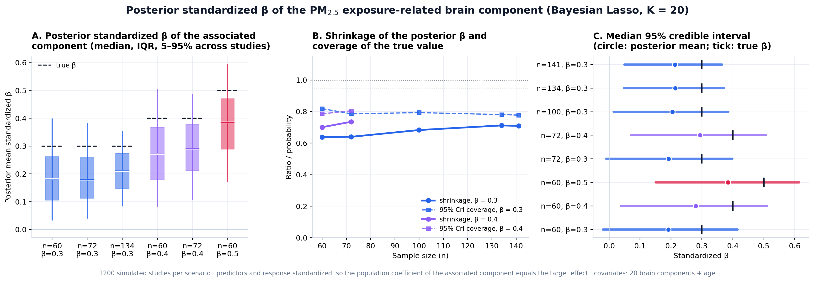
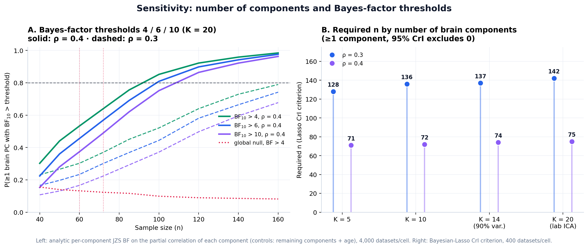

# Introduction

Fine particulate matter (PM$_{2.5}$) is an established neurotoxic exposure: chronic inhalation is linked to accelerated cognitive decline, structural brain differences and dementia risk, plausibly through neuroinflammatory and cerebrovascular pathways. Santiago's metropolitan region combines high average concentrations with a strong west--east gradient, so a cohort recruited across its comunas carries a real, measurable exposure contrast. This report asks the design question for the exposure arm of the study: *what sample size $n$ yields, with probability $\ge0.80$, that at least one brain principal component is significant on the residential PM$_{2.5}$ exposure index, in a two-sided sense (its $95\%$ credible interval excludes zero), under the laboratory's Bayesian-Lasso pipeline?*

The analysis mirrors the laboratory's practice: the exposure index is regressed on the full set of brain principal components plus age with the hierarchical Bayesian Lasso used by the group (the JAGS `model_string_Lasso`), and a study succeeds when any brain component is credibly associated with the exposure. Section 2 describes the exposure calibration, the choice of a scalar exposure index, the generative model, the analysis model and detection criterion; Section 3 reports the required $n$, the recovery of the posterior standardized $\beta$, the sensitivity analyses, and Cohort 2; Section 4 states the conclusions.

# Methods

## Exposure calibration and the scalar-vs-component decision

**Exposure assignment.** Each participant's long-term exposure is the 2013--2022 mean PM$_{2.5}$ concentration of their residential comuna from the laboratory's own PM$_{2.5}$ model surface: a LightGBM ensemble trained on SINCA monitor data with satellite aerosol optical depth (MAIAC), MERRA-2 and ERA5 meteorology and land-use predictors, validated against monitors at daily $r=0.70$, FAC2 $=0.87$ and mean bias $-5\%$ ($95{,}446$ station-days). After normalising comuna names in the recruitment database, $600$ of $601$ valid records were assigned an exposure, spanning $52$ comunas. The participant-level distribution has mean $24.6$ $\mu$g/m$^{3}$, SD $3.2$, range $4.6$--$32.9$ and skewness $-1.03$: the highest exposures are in western Santiago comunas (Cerro Navia, Pudahuel, Estación Central $\approx28$--$30$), with a lower tail from residents of Las Condes, Lo Barnechea and a few participants outside the metropolitan region (Figure [1](#fig:calib){reference-type="ref" reference="fig:calib"}A--B). At the comuna level the model surface agrees with the ACAG satellite product [@vandonkelaar] ($r=0.71$, identical cohort mean) while resolving stronger within-city contrasts.

**Scalar rather than a principal component.** The exposure repository provides several candidate metrics per comuna, all derived from the same hourly model surface: long-term mean, average peak level, hours above $50$ $\mu$g/m$^{3}$, cumulative dose above $50$, and episode counts. At the comuna level these metrics correlate $0.82$--$1.00$ (Figure [1](#fig:calib){reference-type="ref" reference="fig:calib"}C): they form essentially one dimension, so a first principal component of them would carry over $90\%$ of their variance while adding no information and losing the direct per-$\mu$g/m$^{3}$ reading. We therefore use the **scalar long-term mean** as the exposure index, standardized within the cohort; effect sizes $\rho$ below are per SD of exposure ($1$ SD $=3.2$ $\mu$g/m$^{3}$ in this cohort).

{#fig:calib width="100%"}

**Brain components.** As in the hormonal analysis of this project, the brain side is calibrated from the laboratory's DKT-atlas cortical-thickness data restricted to the 40--55-year window ($54$ participants $\times$ 62 ROIs): PC1 carries $60.4\%$ of the variance (global thickness) and correlates with age at $r=-0.171$; components 1--10 explain $86.8\%$, 1--14 $90.8\%$ and 1--20 $94.7\%$. The primary simulation retains $K=20$ components (the laboratory's ICA default), with $K=14$, $10$ and $5$ as sensitivity analyses.

## Generative model (Cohort 1)

For each simulated participant $i=1,\dots,n$, with standardized age $a_i\sim\mathcal{N}(0,1)$: $$\begin{aligned}
\mathrm{PCb}_{i1} &= c_b\, a_i + \sqrt{1-c_b^{2}}\;e_{i1}, \qquad c_b=-0.17,\nonumber\\
\mathrm{PCb}_{ij} &\sim \mathcal{N}(0,1) \quad j=2,\dots,K,\\[2pt]
y_i &= \textstyle\sum_{j\in\mathcal{T}} \rho\,\mathrm{PCb}_{ij}
\;+\; \sqrt{1-|\mathcal{T}|\rho^{2}}\;\varepsilon_i,
\qquad \varepsilon_i\sim\mathcal{N}(0,1),
\end{aligned}$$ where $y$ is the standardized PM$_{2.5}$ exposure index and $\mathcal{T}$ indexes the truly associated brain component(s) with standardized effect $\rho$ each. Unlike the hormonal index, the exposure has no age dependence in the cohort database, so its age coefficient is set to zero; age still enters the design matrix as a covariate because the first brain component is age-related. The true components are never the age-related first component. Scenarios: one true component with $\rho\in\{0.2,0.3,0.4,0.5\}$; two true components with $\rho=0.3$ each; and the global null.

## Analysis model, detection criterion, and reported coefficient

Each simulated dataset is analysed with the laboratory's hierarchical Bayesian Lasso, with $y$ = exposure index and design matrix $[\mathrm{PCb}_{1},\dots,\mathrm{PCb}_{K},\ a]$, all $p=K{+}1$ predictors penalized: $$y_i \sim \mathcal{N}\!\bigl(\beta_0 + \mathbf{x}_i^{\top}\boldsymbol\beta,\ \sigma^2\bigr),\quad
\beta_0\sim\mathcal{N}(0,10^2),\quad \sigma^2\sim\text{Inv-Gamma}(0.01,0.01),$$ $$\beta_j\mid\sigma^2,\tau_j^2 \sim \mathcal{N}(0,\sigma^2\tau_j^2),\quad
\tau_j^2\sim\text{Exp}(\lambda^2/2),
\qquad
\lambda = p\,\sqrt{\widehat{\mathrm{Var}}(\text{OLS residuals})}\Big/\sum_j|\hat\beta_j^{\mathrm{OLS}}| .$$ A brain component is significant when its equal-tailed $95\%$ credible interval excludes zero, in either direction; a study is a *success* when at least one of the $K$ brain components is significant, and $n^{*}$ is the smallest $n$ with success probability $\ge0.80$. The family-wise false-detection rate under the global null is reported alongside. We additionally evaluate the quantity a reader interprets, the posterior standardized $\beta$ of the associated component (population value $=\rho$ by construction): posterior mean, $95\%$ credible interval, shrinkage factor, coverage, and the probability that the largest posterior $|\beta|$ belongs to the truly associated component. As a complementary evidence scale, the default JZS Bayes factor on each component's partial correlation (controls: remaining components + age; $m=n-K$) defines success at thresholds $\mathrm{BF}_{10}\ge4$, $6$, $10$. The batched exact Gibbs sampler and its verification against a scalar reference implementation and analytic Bayes factors are as described previously for this project ($400$ datasets per grid cell; $1{,}200$ for the $\beta$-recovery scenarios; $3{,}000$ iterations, $800$ burn-in).

## Cohort 2 (MCI vs. HC, with the exposure in the model)

Cohort 2 follows the same logic with the group indicator as response: $y$ = standardized balanced group label (age-matched groups), design $=[\mathrm{PCb}_{1},\dots,\mathrm{PCb}_{20},\ \mathrm{PM}_{2.5},\ a]$, all penalized. One truly discriminating brain component carries an MCI--HC separation of Cohen's $d\in\{0.5,0.65,0.8,1.0\}$; the PM$_{2.5}$ exposure enters with an optional MCI--HC separation $d_h\in\{0,0.3\}$ (plausible if cases and controls differ in residential exposure histories). The success criterion is unchanged: at least one *brain* component with $95\%$ CrI excluding zero; the significance of the exposure coefficient is tracked separately.

# Results

## Cohort 1: required $n$

::: {#tab:nreq}
| Scenario                        | Required $n$ |
|:--------------------------------|-------------:|
| One component, $\rho=0.2$       |         n.a. |
| One component, $\rho=0.3$       |      **142** |
| One component, $\rho=0.4$       |       **75** |
| One component, $\rho=0.5$       |           42 |
| Two components, $\rho=0.3$ each |       **78** |

: Required $n$ for $P(\ge1$ brain component significant$)\ge0.80$ ($K=20$; two-sided $95\%$ CrI). "n.a." = not attainable with $n\le160$.
:::

::: {#tab:opera}
|                               |             $n=60$ |           |    $n=72$ |           |
|:-----------------------------:|-------------------:|----------:|----------:|----------:|
| True effect $\rho$ |                any |      true |       any |      true |
|              0.2              |              0.295 |     0.133 |     0.290 |     0.150 |
|              0.3              |              0.485 |     0.355 |     0.517 |     0.435 |
|              0.4              |              0.728 |     0.685 |     0.785 |     0.743 |
|              0.5              |          **0.917** | **0.915** | **0.935** | **0.935** |
|       $0$ (global null)       | family-wise: 0.185 |           |     0.168 |           |

: Operating characteristics at $n=60$ and $n=72$ ($K=20$, one true component). "Any" = design criterion; "true" = the truly associated component is among the significant ones.
:::

Four findings summarize the analysis. First, under the laboratory's own criterion a sample of $n=60$ reaches a detection probability of $0.728$ for a single associated component of $\rho=0.4$ and $0.917$ for $\rho=0.5$; the $0.80$ target at $\rho=0.4$ is attained at $n^{*}=75$, and $\rho=0.5$ requires only $n^{*}=42$. Second, a moderate single-component effect of $\rho=0.3$, which is the magnitude most often reported for air-pollution effects on brain structure, requires $n^{*}=142$, and $\rho=0.2$ is not attainable within $n\le160$; however, if the exposure signal is spread over *two* brain components of $\rho=0.3$ each, a plausible scenario for a diffuse environmental insult, the requirement drops to $n^{*}=78$ ($0.71$ at $n=60$, $0.78$ at $n=72$). Third, the family-wise false-detection rate of the criterion under the global null is non-trivial because twenty components are tested jointly: it is $0.24$ at $n=40$ and $0.185$ to $0.168$ at $n=60$ to $72$, with on average $0.2$ falsely selected components per dataset; accordingly, Table [2](#tab:opera){reference-type="ref" reference="tab:opera"} also reports the probability that the *true* component is detected, and the conclusions recommend stability checks for any single-component claim. Fourth, the results are robust to the number of retained components (Table [5](#tab:sens){reference-type="ref" reference="tab:sens"}): across $K\in\{5,10,14,20\}$ the required $n$ spans only 71 to 75 at $\rho=0.4$ and 128 to 142 at $\rho=0.3$, while the family-wise rate falls sharply with fewer components (from $0.168$ at $K=20$ to $0.043$ at $K=5$, at $n=72$).

{#fig:lasso width="100%"}

## Posterior standardized $\beta$ of the associated component

::: {#tab:beta}
| $n$ | True $\beta$ | Posterior $\beta$ | Shrinkage |   Median 95% CrI | Coverage | Selects true |
|:---:|:------------:|------------------:|----------:|-----------------:|---------:|-------------:|
| 60  |     0.30     |             0.192 |      0.64 | $[-0.02,\ 0.42]$ |     0.82 |         0.55 |
| 72  |     0.30     |             0.192 |      0.64 | $[-0.01,\ 0.40]$ |     0.79 |         0.62 |
| 100 |     0.30     |             0.205 |      0.68 |  $[0.01,\ 0.39]$ |     0.79 |         0.76 |
| 134 |     0.30     |             0.214 |      0.71 |  $[0.05,\ 0.37]$ |     0.78 |         0.88 |
| 60  |     0.40     |             0.280 |      0.70 |  $[0.04,\ 0.51]$ |     0.79 |         0.79 |
| 72  |     0.40     |             0.294 |      0.74 |  $[0.07,\ 0.51]$ |     0.81 |         0.87 |
| 60  |     0.50     |             0.385 |      0.77 |  $[0.15,\ 0.61]$ |     0.80 |         0.95 |

: Recovery of the posterior standardized $\beta$ ($K=20$ plus age; $1{,}200$ simulated studies per scenario). Effects are per SD of exposure ($3.2$ $\mu$g/m$^{3}$).
:::

Three properties of the reported coefficient follow (Figure [3](#fig:beta){reference-type="ref" reference="fig:beta"}). First, the Lasso prior shrinks the posterior $\beta$ towards zero: at $n=60$ the posterior mean recovers $64\%$ of a true $\beta=0.3$, $70\%$ of $0.4$ and $77\%$ of $0.5$, and for $\beta=0.3$ the factor climbs to $0.71$ at $n=134$. Published effect sizes from this pipeline are therefore conservative by construction: an estimated $\beta$ of $0.2$ per SD of exposure ($3.2$ $\mu$g/m$^{3}$) is compatible with a true effect near $0.3$. Second, as a direct consequence, the nominal $95\%$ credible interval covers the true value about $79\%$ of the time; the interval is calibrated for the shrunk posterior, not for the unshrunk parameter, which argues for reporting the interval together with the shrinkage factor. Third, precision and attribution improve steadily with $n$: the median interval width falls from $0.43$ at $n=60$ to $0.32$ at $n=134$ for $\beta=0.3$, and the probability that the largest posterior coefficient belongs to the truly associated component rises from $0.55$ to $0.88$ over the same range, already reaching $0.79$ at $n=60$ when $\beta=0.4$.

{#fig:beta width="100%"}

## Sensitivity: number of components and Bayes-factor thresholds

::: {#tab:sens}
| Components        | $n^{*}$, $\rho=0.3$ | $n^{*}$, $\rho=0.4$ | FW rate |
|:------------------|--------------------:|--------------------:|--------:|
| $K=5$             |                 128 |                  71 |   0.043 |
| $K=10$            |                 136 |                  72 |   0.077 |
| $K=14$ (90% var.) |                 137 |                  74 |   0.113 |
| $K=20$ (lab ICA)  |                 142 |                  75 |   0.168 |

: Left: sensitivity of the required $n$ to the number of retained components (Lasso-CrI criterion; family-wise rate under the null at $n=72$). Right: required $n$ when success demands $\ge1$ component with $\mathrm{BF}_{10}$ above a threshold ($K=20$).
:::

::: {#tab:sens}
| $\rho$ | $\mathrm{BF}\ge4$ | $\mathrm{BF}\ge6$ | $\mathrm{BF}\ge10$ |
|:------:|------------------:|------------------:|-------------------:|
|  0.3   |              n.a. |              n.a. |               n.a. |
|  0.4   |                92 |                99 |                109 |
|  0.5   |                63 |                68 |                 73 |

: Left: sensitivity of the required $n$ to the number of retained components (Lasso-CrI criterion; family-wise rate under the null at $n=72$). Right: required $n$ when success demands $\ge1$ component with $\mathrm{BF}_{10}$ above a threshold ($K=20$).
:::

The Lasso criterion is stable across the retained dimensionality: moving from $K=20$ to $K=5$ changes the required $n$ by less than ten participants at either effect size, while the family-wise false-detection rate under the null falls from $0.168$ to $0.043$, an argument for prespecifying a reduced component set. Requiring component-level Bayes factors instead of credible intervals buys specificity at a quantified price: at $\rho=0.4$ the required $n$ rises from 75 (CrI criterion) to 92, 99 and 109 for $\mathrm{BF}_{10}>4$, $6$ and $10$; at $\rho=0.5$ the corresponding requirements are 63, 68 and 73.

{#fig:kbf width="100%"}

## Cohort 2: MCI vs. HC with the exposure in the model

::: {#tab:c2}
| MCI--HC separation (1 component) | $d=0.50$ | $d=0.65$ | $d=0.80$ |  $d=1.00$ |
|:---------------------------------|---------:|---------:|---------:|----------:|
| Required $n$ per group           |     n.a. |       70 |   **42** |    **26** |
| $P(\ge1)$ at $30$/group          |    0.350 |    0.468 |    0.632 | **0.875** |

: Cohort 2 (Bayesian Lasso on $20$ brain components + PM$_{2.5}$ exposure + age; success = $\ge1$ brain component with $95\%$ CrI excluding 0; no exposure group effect, $d_h=0$). "n.a." = not attainable with $n\le80$ per group.
:::

Family-wise false detection under the global null: $0.168$ at $30$/group, $0.185$ at $40$/group; false significance of the PM$_{2.5}$ exposure coefficient when it has no group effect: $\approx0.01$.

Under the pipeline criterion, $30$ per group reaches $0.632$ at $d=0.8$ and $0.875$ at $d=1.0$; securing the $0.80$ target at $d=0.8$ requires $42$ per group ($26$ per group suffice at $d=1.0$, while $d=0.65$ requires $70$). Regarding the PM$_{2.5}$ exposure itself: its inclusion in the model costs essentially nothing (its false-significance rate is $\approx1\%$), but a small MCI--HC exposure difference ($d_h=0.3$, about $1$ $\mu$g/m$^{3}$ between groups) is rarely detected at these sample sizes ($P\le0.20$ up to $80$ per group; Figure [5](#fig:c2){reference-type="ref" reference="fig:c2"}B), so exposure group effects in Cohort 2 should be framed as exploratory rather than confirmatory.

{#fig:c2 width="100%"}

# Conclusion

Under the laboratory's actual analysis pipeline, a Bayesian Lasso regressing the standardized residential PM$_{2.5}$ exposure index on twenty brain principal components plus age, with success defined as at least one brain component whose $95\%$ credible interval excludes zero in either direction, the required sample sizes are: $n^{*}=42$ for a strong single-component effect ($\rho=0.5$), $n^{*}=75$ for $\rho=0.4$, and $n^{*}=142$ for $\rho=0.3$; with two associated components of $\rho=0.3$ each, $n^{*}=78$. A sample of $n=60$ is adequate for strong effects ($0.92$ at $\rho=0.5$, $0.73$ at $\rho=0.4$) and $n=72$ secures the $0.80$ target at $\rho=0.4$. The air-pollution neuroimaging literature, however, mostly reports standardized effects near $0.2$ to $0.3$ per SD of long-term exposure, and the exposure contrast within a single metropolitan area (SD $3.2$ $\mu$g/m$^{3}$ in this cohort) is modest. The moderate scenario should therefore anchor the planning: detecting one $\rho=0.3$ component demands roughly $142$ participants, while the distributed two-component scenario, arguably the most realistic for a diffuse environmental insult, is secured with $n^{*}=78$.

Two practical advantages of the exposure arm follow. First, the exposure index costs nothing per participant: it is reconstructed from the residential comuna, and $600$ of the $601$ current records already carry an assigned exposure across $52$ comunas, so the binding constraint is imaging, not exposure assessment. A nested design that adds structural MRI to approximately $142$ georeferenced participants would power the moderate single-component scenario, while the full multimodal protocol is retained in a $60$ to $72$ participant core. Second, recruitment can actively widen the exposure contrast: oversampling residents of low-exposure comunas (Las Condes, Lo Barnechea, San José de Maipo) and of comunas outside the metropolitan region would raise the exposure SD above $3.2$ $\mu$g/m$^{3}$ and make every tabulated scenario easier to reach.

Reported effect sizes deserve the same caveat as any Lasso output: the posterior standardized $\beta$ is shrunk to roughly $64$ to $77\%$ of its true value and its nominal $95\%$ interval covers the truth about $79\%$ of the time, so published magnitudes are conservative. Because the "at least one component" criterion carries a family-wise false-detection rate near $0.17$ at the planning sample sizes, a positive finding should be accompanied by per-component posterior summaries and stability checks, or by the stricter Bayes-factor thresholds of Table [5](#tab:sens){reference-type="ref" reference="tab:sens"}, which raise the requirement at $\rho=0.4$ to 92 to 109 participants. Cohort 2 was dimensioned under the same logic with the exposure in the model: $26$ per group for $d=1.0$, $42$ per group for $d=0.8$ and $70$ per group for $d=0.65$, with exposure group differences detectable only as exploratory signals. Overall, $n=72$ powers the optimistic single-component scenario and the distributed scenario, and roughly $142$ georeferenced participants with MRI are the route to the literature-typical effect size.

# Reproducibility

All computations use fixed seeds. The engine is `bfda_lasso_multivariante.py` with the flag `--predictor pm25` (plus `--extra`, `--beta-posterior`, `--cohorte2` for the corresponding sections); outputs land in `results/pm25/`. Calibration inputs: `data/calibracion_pm25.csv` (participant-level residential exposure, built from the model's daily surface `pm25_comunal_diario.csv`, aggregated 2013--2022 in `pm25_modelo_media_comunal_2013_2022.csv`, and the recruitment database) and `data/calibracion_dkt_eigenvalues.csv`.
