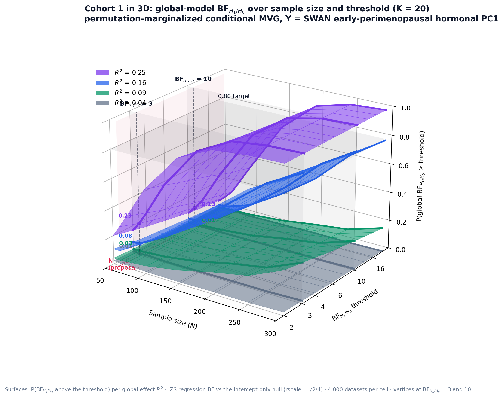

# Introduction

The study will recruit **Cohort 1**: women aged 40--55 across the menopausal transition, characterized with serum FSH and 17$\beta$-estradiol, structural MRI (cortical thickness, DKT atlas), DWI, and EEG; and **Cohort 2**: women aged 60--75 with Mild Cognitive Impairment (MCI) and cognitively healthy controls. The central Cohort-1 hypothesis is that inter-individual differences in the hormonal challenge of the transition, summarized by the first principal component (PC1) of $\log_{10}$ FSH and $\log_{10}$ estradiol, are expressed in the brain's principal modes of structural variation.

This report dimensions the study under a criterion designed to remove every subjective assumption about *where* the signal lives. The association is defined only by a global effect size $R^{2}$, the share of variance of the hormonal PC1 jointly explained by the brain components; the allocation of that effect across components is treated as a nuisance parameter and marginalized by random permutation of the empirical variance profile; and the evidence is the Bayes factor of the full regression model against the null model with no predictors. The required sample size is the smallest $N$ at which at least $80\%$ of simulated studies reach the evidence threshold $\tau$.

Two design dimensions are explored throughout: the number of retained brain components $K\in\{5,10,14,20\}$, where $K=14$ is the smallest set jointly explaining $90\%$ of the empirical brain variance and $K=20$ matches the laboratory's ICA default; and the evidence threshold $\tau\in\{4,6,10\}$. The effect grid is $R^{2}\in\{0.04,0.09,0.16,0.25\}$, spanning associations from weak to strong: since a single component with standardized coefficient $\rho$ contributes $R^{2}=\rho^{2}$, this grid corresponds to component-level effects of $0.2$ to $0.5$ in correlation units, the range reported in the hormone--brain literature. Section 2 describes the empirical calibration, the mathematical formulation of the generator, and the evidence measure; Section 3 reports the required sample sizes for both cohorts; Section 4 states the conclusions.

# Methods

## Empirical inputs

**Response.** $Y$ is the standardized first principal component of the hormonal assays ($\log_{10}$ FSH and $\log_{10}$ estradiol; $77.7\%$ of variance), drawn from the SWAN Visit-10 early-perimenopausal pool ($n=132$; skewness $-0.57$). In every iteration, $N$ observations are resampled with replacement from this empirical pool, so the simulation inherits the true, non-Gaussian shape of the hormonal distribution.

**Predictors.** $\mathbf{X}$ are $p=K$ principal components of the brain data. Their eigenvalue spectrum $\boldsymbol\lambda$ is taken from the PCA of our DKT cortical-thickness data (40--55-year window, $54$ participants $\times$ 62 ROIs). The spectrum is strongly dominated by the first (global-thickness) component: within the retained set, its normalized weight is $w_1=0.772$ at $K=5$, $0.695$ at $K=10$, $0.665$ at $K=14$, and $0.638$ at $K=20$.

## Mathematical formulation

Let $\mathbf{X}_{\mathrm{pca}}\in\mathbb{R}^{p}$ denote the top $p$ principal components with empirical eigenvalues $\boldsymbol\lambda=[\lambda_1,\dots,\lambda_p]^{\top}$, and let $Y$ denote the standardized empirical response ($\mathbb{E}[Y]=0$, $\mathrm{Var}(Y)=1$).

**Variance partitioning.** The normalized empirical variance profile is $$w_i=\frac{\lambda_i}{\sum_{k=1}^{p}\lambda_k},\qquad \sum_{i=1}^{p}w_i=1 .$$ To remove assumptions about which component carries the signal, the weight vector is treated as a nuisance and marginalized by random permutation at every Monte Carlo iteration: $$\mathbf{w}^{(m)}=\pi(\mathbf{w}),\qquad \pi\sim\mathrm{Uniform}(\mathcal{P}_p).$$

**Covariance-constrained conditional generator.** For a fixed global effect $R^2\in(0,1)$, the cross-correlation vector is $$\boldsymbol\rho=\sqrt{\mathbf{w}^{(m)}R^2}\;\Longrightarrow\;\lVert\boldsymbol\rho\rVert_2^{2}=R^2 ,$$ and the residual variance is deterministically locked at $\sigma_\varepsilon^{2}=1-R^{2}$. To preserve marginal orthogonality of the predictors ($\mathrm{Cov}(\mathbf{X})=\mathbf{I}_p$) while conditioning on empirical draws of $Y$, synthetic predictors follow the conditional multivariate Gaussian $$\mathbf{X}\mid (Y=y)\;\sim\;\mathcal{N}_p\!\bigl(y\,\boldsymbol\rho,\ \boldsymbol\Sigma_{\mathbf{X}\mid Y}\bigr),
\qquad
\boldsymbol\Sigma_{\mathbf{X}\mid Y}=\mathbf{I}_p-\boldsymbol\rho\boldsymbol\rho^{\top},$$ sampled for $N$ observations via the Cholesky factor $\mathbf{L}\mathbf{L}^{\top}=\boldsymbol\Sigma_{\mathbf{X}\mid Y}$: $$\mathbf{X}_{\mathrm{sim}}=\mathbf{y}_{\mathrm{emp}}\boldsymbol\rho^{\top}+\mathbf{Z}\mathbf{L}^{\top},
\qquad \mathbf{Z}\sim\mathcal{N}_{N\times p}(0,1).$$

## Evidence and computation

Each simulated dataset is scored with the Bayes factor of the full Bayesian regression $\mathbf{y}_{\mathrm{emp}}\sim\mathbf{X}_{\mathrm{sim}}$ against the intercept-only null, using the default JZS mixture-of-$g$ prior [@liang2008; @rouder2012]: $$\mathrm{BF}_{H_1/H_0}\;=\;\int_0^{\infty}(1+g)^{\frac{N-p-1}{2}}\bigl[1+(1-\hat R^{2})g\bigr]^{-\frac{N-1}{2}}\,\pi(g)\,dg,
\qquad
\pi(g)=\frac{\sqrt{Ns^{2}/2}}{\Gamma(1/2)}\,g^{-3/2}e^{-Ns^{2}/(2g)},
\tag{6}$$ with prior scale $s=\sqrt{2}/4$, the `BayesFactor::regressionBF` default ("medium"), so the Python engine reproduces the R reference implementation exactly, evaluated analytically. Empirical power and the required sample size are $$\mathrm{Power}(N,R^{2})=\frac{1}{M}\sum_{m=1}^{M}\mathbb{I}\bigl(\mathrm{BF}_{H_1/H_0}^{(m)}\ge\tau\bigr),
\qquad
N^{*}=\min\{N:\ \mathrm{Power}(N,R^{2})\ge0.80\}.$$

Because $\mathrm{BF}_{H_1/H_0}$ is monotone in the sample $\hat R^{2}$ for fixed $(N,p)$, the engine inverts (6) once per $(N,p,\tau)$ and evaluates power over $M=4{,}000$ simulated $\hat R^{2}$ values per cell (batched OLS). The integral was verified against independent adaptive quadrature (relative error $<10^{-10}$). Two further checks are worth noting. First, the false-positive rate $P(\mathrm{BF}_{H_1/H_0}\ge\tau\mid R^{2}=0)$ is monitored across the whole grid. Second, the permutation marginalization was verified to be *exactly* innocuous for this global criterion: by rotation invariance of the Gaussian generator, the distribution of $\hat R^{2}$ depends on $\boldsymbol\rho$ only through $\lVert\boldsymbol\rho\rVert^{2}=R^{2}$, so power is invariant to how the effect is split across components (empirical check: mean $\hat R^{2}$ of $0.2799$ permuted vs. $0.2784$ fixed at $N=100$, $R^{2}=0.10$, $K=20$). The paradigm is therefore alignment-free by construction, which is its design strength.

## Parameter space

Sample sizes $N\in\{50,60,72,100,150,200,250,300\}$ (the specification grid augmented with the proposal-relevant values $60$ and $72$); global effect sizes $R^{2}\in\{0.04,0.09,0.16,0.25\}$ plus the null $R^{2}=0$; components $K\in\{5,10,14,20\}$; thresholds $\tau\in\{4,6,10\}$; $M=4{,}000$ datasets per cell; seed $42$. A faithful R implementation using `BayesFactor::regressionBF` on the same calibration files accompanies the Python engine.

## Cohort 2 under the same paradigm

For the MCI vs. HC cohort the paradigm is applied with the group as response: $y$ is the standardized balanced group indicator ($\pm1$, age-matched groups), and the design contains the $K$ brain components, generated conditionally on $y$ with the permuted empirical spectrum exactly as above, *plus the hormonal PC1* as an additional predictor with point-biserial correlation $\rho_h=d_h/\sqrt{d_h^{2}+4}$ for an MCI--HC hormonal separation $d_h\in\{0,0.3\}$ (so the model has $p=K+1$ covariates and total explained variance $R^{2}+\rho_h^{2}$). The brain-side global effect $R^{2}$ maps onto the overall multivariate Mahalanobis separation between groups as $D=2\sqrt{R^{2}/(1-R^{2})}$: $R^{2}=0.04,\ 0.09,\ 0.16,\ 0.25$ correspond to $D=0.41,\ 0.63,\ 0.87,\ 1.16$, with $D\approx0.87$ matching the magnitude typically reported for MCI alterations. Evidence is the same global-model Bayes factor (6), and $N$ runs over $\{40,60,80,100,150,200,250,300\}$ total (balanced).

# Results

::: {#tab:v4}
|      $K$      | Global effect | $\mathrm{BF}_{H_1/H_0}\ge4$ | $\mathrm{BF}_{H_1/H_0}\ge6$ | $\mathrm{BF}_{H_1/H_0}\ge10$ |
|:-------------:|:--------------|----------------------------:|----------------------------:|-----------------------------:|
|       5       | $R^2=0.09$    |                         244 |                         259 |                          277 |
|       5       | $R^2=0.16$    |                     **125** |                         132 |                          139 |
|       5       | $R^2=0.25$    |                      **68** |                          72 |                           81 |
|      10       | $R^2=0.16$    |                         176 |                         185 |                          194 |
|      10       | $R^2=0.25$    |                          97 |                         103 |                          113 |
| 14 (90% var.) | $R^2=0.16$    |                         219 |                         228 |                          239 |
| 14 (90% var.) | $R^2=0.25$    |                         124 |                         129 |                          135 |
| 20 (lab ICA)  | $R^2=0.16$    |                         277 |                         284 |                          294 |
| 20 (lab ICA)  | $R^2=0.25$    |                         149 |                         153 |                          163 |

: Required $N$ for $\mathrm{Power}\ge0.80$ under the global-model criterion, by number of components $K$, global effect $R^{2}$, and evidence threshold $\tau$. "n.a." = not attainable with $N\le300$.
:::

$R^{2}=0.04$ is not attainable at any $K$ with $N\le300$; $R^{2}=0.09$ is attainable only with $K=5$. False-positive rate under the global null: $<1\%$ at every $(N,K,\tau)$ and decreasing with $N$ (e.g. $K=20$, $\mathrm{BF}\ge4$: $0.005$ at $N=60$, $0.001$ at $N=100$, $0.000$ at $N=300$).

::: {#tab:v4op}
|                |             $K=5$ |                   |                    |            $K=20$ |                   |                    |
|:--------------:|------------------:|------------------:|-------------------:|------------------:|------------------:|-------------------:|
| $N$ | $\mathrm{BF}\ge4$ | $\mathrm{BF}\ge6$ | $\mathrm{BF}\ge10$ | $\mathrm{BF}\ge4$ | $\mathrm{BF}\ge6$ | $\mathrm{BF}\ge10$ |
|       60       |             0.744 |             0.695 |              0.631 |             0.207 |             0.169 |              0.133 |
|       72       |         **0.837** |         **0.801** |              0.751 |             0.277 |             0.240 |              0.199 |
|      100       |             0.952 |             0.939 |              0.917 |             0.499 |             0.454 |              0.407 |

: Operating characteristics at three sample sizes for the strong-effect scenario $R^{2}=0.25$, contrasting a compact and the full component set.
:::

Figure [1](#fig:v4){reference-type="ref" reference="fig:v4"} shows the full power surfaces. Three regularities emerge. First, under the global-model criterion the required $N$ is driven jointly by the effect size and the dimensionality: at $R^{2}=0.25$ the requirement grows from $68$--$81$ with five components to $149$--$163$ with the full laboratory set of twenty, and at $R^{2}=0.16$ from $125$--$139$ to $277$--$294$, because the JZS prior spreads its mass over all $p$ directions and the marginal likelihood pays for every dimension that carries no signal. Second, the evidence threshold matters much less than the dimensionality: moving from $\mathrm{BF}\ge4$ to $\mathrm{BF}\ge10$ adds only $10$--$20$ participants in any attainable cell, whereas quadrupling the component count can double or triple the requirement. Third, the criterion is extremely specific: the probability of reaching any threshold under the global null is below $1\%$ everywhere and vanishes as $N$ grows, the expected consistency property of Bayes factors.

{#fig:v4 width="100%"}

{#fig:tresd_c1 width="92%"}

## Cohort 2

::: {#tab:v4c2}
|      $K$      | Group separation      | $\mathrm{BF}_{H_1/H_0}\ge4$ | $\mathrm{BF}_{H_1/H_0}\ge6$ | $\mathrm{BF}_{H_1/H_0}\ge10$ |
|:-------------:|:----------------------|----------------------------:|----------------------------:|-----------------------------:|
|       5       | $R^2=0.09$ ($D=0.63$) |                         137 |                         142 |                          150 |
|       5       | $R^2=0.16$ ($D=0.87$) |                      **66** |                          70 |                           73 |
|       5       | $R^2=0.25$ ($D=1.16$) |                      **36** |                          39 |                           41 |
|      10       | $R^2=0.16$            |                          92 |                          95 |                           99 |
|      10       | $R^2=0.25$            |                          49 |                          53 |                           57 |
| 14 (90% var.) | $R^2=0.16$            |                         113 |                         117 |                          122 |
| 14 (90% var.) | $R^2=0.25$            |                          62 |                          65 |                           68 |
| 20 (lab ICA)  | $R^2=0.16$            |                         140 |                         144 |                          148 |
| 20 (lab ICA)  | $R^2=0.25$            |                          74 |                          77 |                           82 |

: Cohort 2: required $n$ per group for $\mathrm{Power}\ge0.80$ (total $N$ halved, rounded up), with no hormonal group effect ($d_h=0$). $D=2\sqrt{R^{2}/(1-R^{2})}$ is the equivalent multivariate Mahalanobis separation between groups.
:::

$R^{2}=0.04$ ($D=0.41$) is not attainable at any $K$ with $N\le300$ total, and $R^{2}=0.09$ only with $K=5$. At $30$ per group with $K=5$: power $0.696$ ($\mathrm{BF}\ge4$) and $0.568$ ($\mathrm{BF}\ge10$) for $R^{2}=0.25$, and $0.369$/$0.248$ for $R^{2}=0.16$; at $40$ per group, $0.872$/$0.796$ and $0.517$/$0.394$. Global-null false positives $<1\%$; a hormonal effect alone ($R^{2}=0$, $d_h=0.3$) fires the global criterion rarely ($0.03$--$0.07$ up to $N=300$).

At the group separations typically reported for MCI, the design is feasible provided the component set is compact: with five components, $36$--$41$ per group suffice for $D=1.16$ and $66$--$73$ for $D=0.87$, whereas the full twenty-component set doubles those figures. Including the hormonal component in the model helps rather than costs: when a hormonal MCI--HC difference of $d_h=0.3$ accompanies the brain effect, requirements drop by roughly ten per group (Figure [3](#fig:v4c2){reference-type="ref" reference="fig:v4c2"}B; at $30$ per group and $R^{2}=0.25$, power rises from $0.696$ to $0.780$ at $\mathrm{BF}\ge4$), while a hormonal difference alone almost never fires the global criterion, so its inclusion does not inflate false claims.

{#fig:v4c2 width="100%"}

## Fixed-design addendum: recovery of the multivariate MCI--HC pattern at $n=36$ per group

The same committee question is answered under the alignment-free criterion: the MCI--HC magnitude $d=0.65$--$0.70$ is read as a multivariate Mahalanobis separation $D$, split at random across the components by the permuted spectrum, so $R^{2}=D^{2}/(4+D^{2})$ maps the requested band to $R^{2}=0.096$--$0.109$. Everything else (generator, hormonal PC1 in the model, evidence integral) is exactly as above; $4{,}000$ simulated studies per cell.

::: {#tab:focal45}
| $K$ | Separation             | $\mathrm{BF}_{H_1/H_0}\ge4$ | $\mathrm{BF}_{H_1/H_0}\ge6$ | $\mathrm{BF}_{H_1/H_0}\ge10$ |
|:---:|:-----------------------|----------------------------:|----------------------------:|-----------------------------:|
|  5  | $D=0.65$ ($R^2=0.096$) |                       0.183 |                       0.145 |                        0.109 |
|  5  | $D=0.70$ ($R^2=0.109$) |                       0.239 |                       0.197 |                        0.151 |
| 10  | $D=0.65$ ($R^2=0.096$) |                       0.076 |                       0.058 |                        0.043 |
| 10  | $D=0.70$ ($R^2=0.109$) |                       0.117 |                       0.092 |                        0.068 |
| 14  | $D=0.65$ ($R^2=0.096$) |                       0.051 |                       0.039 |                        0.028 |
| 14  | $D=0.70$ ($R^2=0.109$) |                       0.066 |                       0.053 |                        0.038 |
| 20  | $D=0.65$ ($R^2=0.096$) |                       0.030 |                       0.023 |                        0.016 |
| 20  | $D=0.70$ ($R^2=0.109$) |                       0.038 |                       0.029 |                        0.021 |

: Probability of recovering the multivariate pattern at $n=36$ per group (global-model $\mathrm{BF}_{H_1/H_0}\ge\tau$; no hormonal group effect). $R^{2}=D^{2}/(4+D^{2})$.
:::

Context at $36$/group, $K=5$: $D=0.50$ gives 0.071 and $D=1.00$ gives 0.644 at $\mathrm{BF}\ge4$. False positives under the global null at the focal point: 0.006 ($K=5$) to 0.003 ($K=20$) at $\mathrm{BF}\ge4$. A hormonal group effect $d_h=0.3$ raises recovery at $D=0.65$--$0.70$ to 0.258--0.317 ($\mathrm{BF}\ge4$).

::: {#tab:nreq45}
| $K$ | $D=0.50$ | $D=0.65$ | $D=0.70$ | $D=0.80$ | $D=1.00$ |
|:---:|---------:|---------:|---------:|---------:|---------:|
|  5  |     n.a. |      126 |      106 |       79 |       48 |
| 10  |     n.a. |     n.a. |      151 |      112 |       68 |
| 14  |     n.a. |     n.a. |     n.a. |      136 |       80 |
| 20  |     n.a. |     n.a. |     n.a. |     n.a. |      100 |

: Context: required $n$ per group for $0.80$ power at the requested effect sizes (total $N$ halved, rounded up). "n.a." = not attainable with $N\le320$.
:::

The pattern mirrors every result above: the omnibus criterion pays for dimensionality, so a diffuse $D=0.65$--$0.70$ at $36$ per group yields only $0.18$--$0.24$ recovery with five components, decaying to $0.03$--$0.04$ with twenty, and the evidence threshold matters far less than $K$ (Table [4](#tab:focal45){reference-type="ref" reference="tab:focal45"}). Reaching $0.80$ for this band requires approximately $126$ per group at $D=0.65$ and $106$ at $D=0.70$ with $K=5$ (Table [5](#tab:nreq45){reference-type="ref" reference="tab:nreq45"}); at $36$ per group the criterion only reaches the target for separations near $D=1$ ($0.64$ at $\mathrm{BF}\ge4$). The compensating property is specificity: the global null fires in at most $0.006$ of studies at the focal point, so any positive omnibus result at this $n$ would be trustworthy, just unlikely for the requested effect size.

{#fig:v45 width="100%"}

{#fig:v45tresd width="92%"}

# Conclusion

Under the permutation-marginalized conditional MVG paradigm, with evidence defined as the global-model Bayes factor against the null, the feasibility of the design hinges on how many brain components enter the model. With a compact, prespecified set of five components, a strong association ($R^{2}=0.25$, equivalent to a single component with standardized coefficient $0.5$) requires $68$--$81$ participants depending on the evidence threshold, and a moderate one ($R^{2}=0.16$, coefficient $0.4$) requires $125$--$139$. With the laboratory's full twenty-component set the same effects require $149$--$163$ and $277$--$294$, and nothing below $R^{2}=0.16$ is detectable under $N=300$. An effect of $R^{2}=0.04$ is beyond reach at any dimensionality and should not be promised.

The same structure governs Cohort 2, where the hormonal component is included alongside the brain components: with five components, $36$--$41$ participants per group detect a group separation of $D=1.16$ and $66$--$73$ detect $D=0.87$, while twenty components double those numbers. Including the hormonal predictor is costless in specificity and beneficial when a hormonal group difference is present, shortening requirements by about ten per group; a hormonal difference on its own, however, almost never triggers the global criterion, so hormonal group effects should be examined through their own coefficient rather than through the omnibus test.

Three practical recommendations follow. First, prespecify a compact component set: reducing $K$ from twenty to five is by far the most efficient lever available, worth more than any change of evidence threshold. Second, choose the threshold for interpretability rather than for power, since $\mathrm{BF}\ge10$ costs only ten to twenty participants more than $\mathrm{BF}\ge4$ while providing markedly stronger evidence. Third, exploit the criterion's exceptional specificity: with false-positive rates below $1\%$ that decrease with $N$, a positive global Bayes factor is strong evidence, and the design can be reported as conservative by construction. The paradigm's structural strengths support this reading: it makes no assumption about which component carries the signal (a property that holds exactly, by rotation invariance of the Gaussian generator, and which we verify empirically), and it inherits the true empirical distribution of the hormonal index through bootstrap resampling. All requirements are reproducible with the released Python engine, analytically equivalent to `BayesFactor::regressionBF`, and the accompanying R reference implementation.

# Reproducibility

|                                        |                                                                                                                           |
|:---------------------------------------|:--------------------------------------------------------------------------------------------------------------------------|
| `bfda_v4_condicional_mvg.py`           | Full $K\times R^{2}\times\tau$ grid, figures and tables; `--cohorte2` runs Cohort 2 ($\sim$1--4 min each) |
| `bfda_v4_condicional_mvg.R`            | Reference implementation (`BayesFactor::regressionBF`)                                                                    |
| `data/calibracion_swan_pc1.csv`        | Empirical $Y$ pool (standardized hormonal PC1 by STRAW stage)                                                             |
| `data/calibracion_dkt_eigenvalues.csv` | Empirical DKT eigenvalue spectrum (top 20)                                                                                |

Key options of the Python engine: `--nsims`, `--seed`, `--target`, `--rscale`, `--pool` (`early_peri` / `transition` / `all`), `--cohorte2`. Defaults: $M=4{,}000$, seed $42$, target $0.80$, rscale $\sqrt{2}/4$, early-perimenopausal pool.
