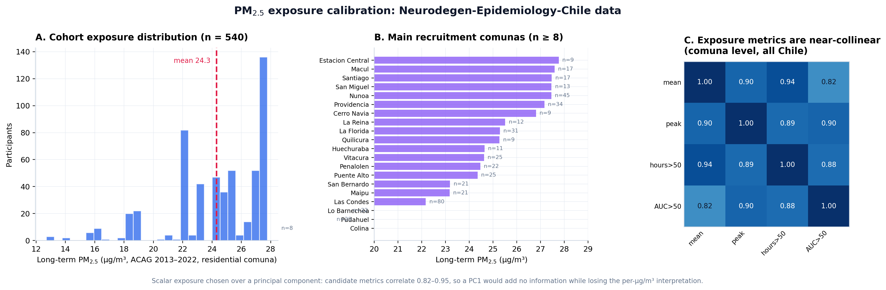
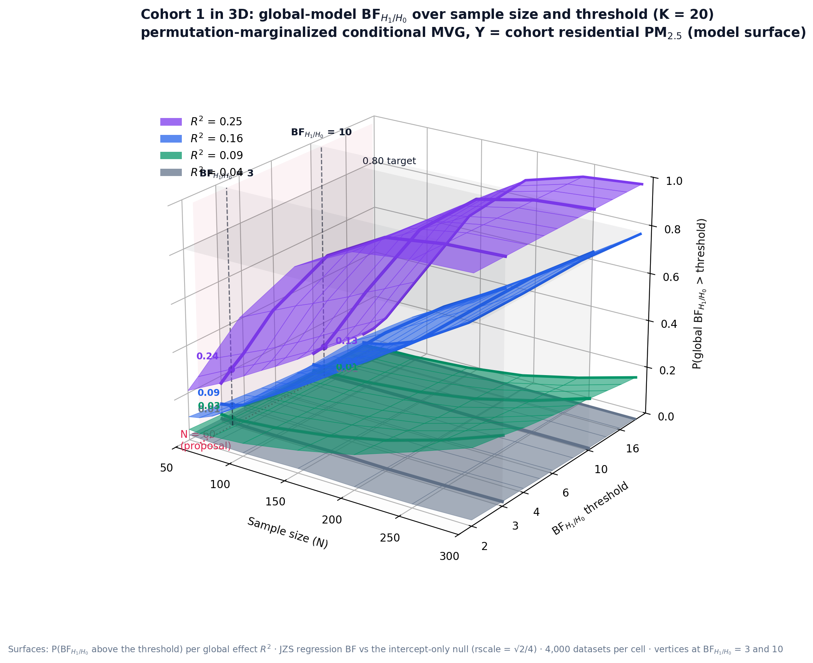

# Introduction

Fine particulate matter (PM$_{2.5}$) is an established neurotoxic exposure: chronic inhalation is associated with accelerated cognitive decline, structural brain differences and dementia risk, plausibly through neuroinflammatory and cerebrovascular pathways. Santiago's metropolitan region combines high average concentrations with a strong west--east gradient, so a cohort recruited across its comunas carries a real, measurable exposure contrast. The study will recruit **Cohort 1**: adults characterized with structural MRI (cortical thickness, DKT atlas), DWI and EEG, whose long-term residential PM$_{2.5}$ exposure can be reconstructed from their comuna of residence; and **Cohort 2**: adults aged 60--75 with Mild Cognitive Impairment (MCI) and cognitively healthy controls. The central exposure hypothesis is that inter-individual differences in long-term PM$_{2.5}$ exposure are expressed in the brain's principal modes of structural variation.

This report dimensions the study under a criterion designed to remove every subjective assumption about *where* the signal lives. The association is defined only by a global effect size $R^{2}$, the share of variance of the exposure index jointly explained by the brain components; the allocation of that effect across components is treated as a nuisance parameter and marginalized by random permutation of the empirical variance profile; and the evidence is the Bayes factor of the full regression model against the null model with no predictors. The required sample size is the smallest $N$ at which at least $80\%$ of simulated studies reach the evidence threshold $\tau$.

Two design dimensions are explored throughout: the number of retained brain components $K\in\{5,10,14,20\}$, where $K=14$ is the smallest set jointly explaining $90\%$ of the empirical brain variance and $K=20$ matches the laboratory's ICA default; and the evidence threshold $\tau\in\{4,6,10\}$. The effect grid is $R^{2}\in\{0.04,0.09,0.16,0.25\}$, spanning associations from weak to strong: since a single component with standardized coefficient $\rho$ contributes $R^{2}=\rho^{2}$, this grid corresponds to component-level effects of $0.2$ to $0.5$ in correlation units. Air-pollution neuroimaging studies typically report effects at the lower end of this range, a point taken up in the conclusions. Section 2 describes the empirical calibration, the mathematical formulation of the generator, and the evidence measure; Section 3 reports the required sample sizes for both cohorts; Section 4 states the conclusions.

# Methods

## Empirical inputs

**Response.** $Y$ is the standardized long-term residential PM$_{2.5}$ exposure index. Each participant's exposure is the 2013--2022 mean PM$_{2.5}$ concentration of their residential comuna from the laboratory's own PM$_{2.5}$ model surface: a LightGBM ensemble trained on SINCA monitor data with satellite aerosol optical depth (MAIAC), MERRA-2 and ERA5 meteorology and land-use predictors, validated against monitors at daily $r=0.70$, FAC2 $=0.87$ and mean bias $-5\%$ ($95{,}446$ station-days); at the comuna level it agrees with the ACAG satellite product [@vandonkelaar] ($r=0.71$, identical cohort mean) while resolving stronger within-city contrasts. After normalizing comuna names in the recruitment database, $600$ of $601$ valid records were assigned an exposure, spanning $52$ comunas. The participant-level distribution has mean $24.6$ $\mu$g/m$^{3}$, SD $3.2$, range $4.6$--$32.9$ and skewness $-1.03$: most participants live in high-exposure Santiago comunas, with a lower tail (Figure [1](#fig:calib){reference-type="ref" reference="fig:calib"}A--B). In every iteration, $N$ observations are resampled with replacement from this empirical pool of $600$ standardized values, so the simulation inherits the true, strongly left-skewed shape of the exposure distribution. The candidate exposure metrics, all derived from the same hourly model surface (long-term mean, mean peak level, hours above $50$ $\mu$g/m$^{3}$, cumulative dose above $50$, episode counts) correlate $0.82$--$1.00$ at the comuna level (Figure [1](#fig:calib){reference-type="ref" reference="fig:calib"}C); they form essentially one dimension, so the scalar long-term mean is used as the exposure index and effect sizes below are per SD of exposure ($1$ SD $=3.2$ $\mu$g/m$^{3}$ in this cohort).

{#fig:calib width="100%"}

**Predictors.** $\mathbf{X}$ are $p=K$ principal components of the brain data. Their eigenvalue spectrum $\boldsymbol\lambda$ is taken from the PCA of our DKT cortical-thickness data (40--55-year window, $54$ participants $\times$ 62 ROIs). The spectrum is strongly dominated by the first (global-thickness) component: within the retained set, its normalized weight is $w_1=0.772$ at $K=5$, $0.695$ at $K=10$, $0.665$ at $K=14$, and $0.638$ at $K=20$.

## Mathematical formulation

Let $\mathbf{X}_{\mathrm{pca}}\in\mathbb{R}^{p}$ denote the top $p$ principal components with empirical eigenvalues $\boldsymbol\lambda=[\lambda_1,\dots,\lambda_p]^{\top}$, and let $Y$ denote the standardized empirical response ($\mathbb{E}[Y]=0$, $\mathrm{Var}(Y)=1$).

**Variance partitioning.** The normalized empirical variance profile is $$w_i=\frac{\lambda_i}{\sum_{k=1}^{p}\lambda_k},\qquad \sum_{i=1}^{p}w_i=1 .$$ To remove assumptions about which component carries the signal, the weight vector is treated as a nuisance and marginalized by random permutation at every Monte Carlo iteration: $$\mathbf{w}^{(m)}=\pi(\mathbf{w}),\qquad \pi\sim\mathrm{Uniform}(\mathcal{P}_p).$$

**Covariance-constrained conditional generator.** For a fixed global effect $R^2\in(0,1)$, the cross-correlation vector is $$\boldsymbol\rho=\sqrt{\mathbf{w}^{(m)}R^2}\;\Longrightarrow\;\lVert\boldsymbol\rho\rVert_2^{2}=R^2 ,$$ and the residual variance is deterministically locked at $\sigma_\varepsilon^{2}=1-R^{2}$. To preserve marginal orthogonality of the predictors ($\mathrm{Cov}(\mathbf{X})=\mathbf{I}_p$) while conditioning on empirical draws of $Y$, synthetic predictors follow the conditional multivariate Gaussian $$\mathbf{X}\mid (Y=y)\;\sim\;\mathcal{N}_p\!\bigl(y\,\boldsymbol\rho,\ \boldsymbol\Sigma_{\mathbf{X}\mid Y}\bigr),
\qquad
\boldsymbol\Sigma_{\mathbf{X}\mid Y}=\mathbf{I}_p-\boldsymbol\rho\boldsymbol\rho^{\top},$$ sampled for $N$ observations via the Cholesky factor $\mathbf{L}\mathbf{L}^{\top}=\boldsymbol\Sigma_{\mathbf{X}\mid Y}$: $$\mathbf{X}_{\mathrm{sim}}=\mathbf{y}_{\mathrm{emp}}\boldsymbol\rho^{\top}+\mathbf{Z}\mathbf{L}^{\top},
\qquad \mathbf{Z}\sim\mathcal{N}_{N\times p}(0,1).$$

## Evidence and computation

Each simulated dataset is scored with the Bayes factor of the full Bayesian regression $\mathbf{y}_{\mathrm{emp}}\sim\mathbf{X}_{\mathrm{sim}}$ against the intercept-only null, using the default JZS mixture-of-$g$ prior [@liang2008; @rouder2012]: $$\mathrm{BF}_{H_1/H_0}\;=\;\int_0^{\infty}(1+g)^{\frac{N-p-1}{2}}\bigl[1+(1-\hat R^{2})g\bigr]^{-\frac{N-1}{2}}\,\pi(g)\,dg,
\qquad
\pi(g)=\frac{\sqrt{Ns^{2}/2}}{\Gamma(1/2)}\,g^{-3/2}e^{-Ns^{2}/(2g)},
\tag{6}$$ with prior scale $s=\sqrt{2}/4$, the `BayesFactor::regressionBF` default ("medium"), so the Python engine reproduces the R reference implementation exactly, evaluated analytically. Empirical power and the required sample size are $$\mathrm{Power}(N,R^{2})=\frac{1}{M}\sum_{m=1}^{M}\mathbb{I}\bigl(\mathrm{BF}_{H_1/H_0}^{(m)}\ge\tau\bigr),
\qquad
N^{*}=\min\{N:\ \mathrm{Power}(N,R^{2})\ge0.80\}.$$

Because $\mathrm{BF}_{H_1/H_0}$ is monotone in the sample $\hat R^{2}$ for fixed $(N,p)$, the engine inverts (6) once per $(N,p,\tau)$ and evaluates power over $M=4{,}000$ simulated $\hat R^{2}$ values per cell (batched OLS). The integral was verified against independent adaptive quadrature (relative error $<10^{-10}$). Two further checks are worth noting. First, the false-positive rate $P(\mathrm{BF}_{H_1/H_0}\ge\tau\mid R^{2}=0)$ is monitored across the whole grid. Second, the permutation marginalization was verified to be *exactly* innocuous for this global criterion: by rotation invariance of the Gaussian generator, the distribution of $\hat R^{2}$ depends on $\boldsymbol\rho$ only through $\lVert\boldsymbol\rho\rVert^{2}=R^{2}$, so power is invariant to how the effect is split across components (empirical check with the exposure pool: mean $\hat R^{2}$ of $0.2814$ permuted vs. $0.2801$ fixed at $N=100$, $R^{2}=0.10$, $K=20$). The paradigm is therefore alignment-free by construction, which is its design strength.

## Parameter space

Sample sizes $N\in\{50,60,72,100,150,200,250,300\}$ (the specification grid augmented with the proposal-relevant values $60$ and $72$); global effect sizes $R^{2}\in\{0.04,0.09,0.16,0.25\}$ plus the null $R^{2}=0$; components $K\in\{5,10,14,20\}$; thresholds $\tau\in\{4,6,10\}$; $M=4{,}000$ datasets per cell; seed $42$. A faithful R implementation using `BayesFactor::regressionBF` on the same calibration files accompanies the Python engine.

## Cohort 2 under the same paradigm

For the MCI vs. HC cohort the paradigm is applied with the group as response: $y$ is the standardized balanced group indicator ($\pm1$, age-matched groups), and the design contains the $K$ brain components, generated conditionally on $y$ with the permuted empirical spectrum exactly as above, *plus the residential PM$_{2.5}$ exposure* as an additional predictor with point-biserial correlation $\rho_h=d_h/\sqrt{d_h^{2}+4}$ for an MCI--HC exposure difference $d_h\in\{0,0.3\}$, plausible when cases and controls differ in residential exposure histories (so the model has $p=K+1$ covariates and total explained variance $R^{2}+\rho_h^{2}$). The brain-side global effect $R^{2}$ maps onto the overall multivariate Mahalanobis separation between groups as $D=2\sqrt{R^{2}/(1-R^{2})}$: $R^{2}=0.04,\ 0.09,\ 0.16,\ 0.25$ correspond to $D=0.41,\ 0.63,\ 0.87,\ 1.16$, with $D\approx0.87$ matching the magnitude typically reported for MCI alterations. Evidence is the same global-model Bayes factor (6), and $N$ runs over $\{40,60,80,100,150,200,250,300\}$ total (balanced).

# Results

::: {#tab:v4}
|      $K$      | Global effect | $\mathrm{BF}_{H_1/H_0}\ge4$ | $\mathrm{BF}_{H_1/H_0}\ge6$ | $\mathrm{BF}_{H_1/H_0}\ge10$ |
|:-------------:|:--------------|----------------------------:|----------------------------:|-----------------------------:|
|       5       | $R^2=0.09$    |                         248 |                         266 |                          285 |
|       5       | $R^2=0.16$    |                     **130** |                         137 |                          144 |
|       5       | $R^2=0.25$    |                      **70** |                          76 |                           84 |
|      10       | $R^2=0.16$    |                         181 |                         187 |                          195 |
|      10       | $R^2=0.25$    |                         100 |                         107 |                          116 |
| 14 (90% var.) | $R^2=0.16$    |                         222 |                         230 |                          237 |
| 14 (90% var.) | $R^2=0.25$    |                         126 |                         131 |                          135 |
| 20 (lab ICA)  | $R^2=0.16$    |                         275 |                         283 |                          291 |
| 20 (lab ICA)  | $R^2=0.25$    |                         149 |                         156 |                          164 |

: Required $N$ for $\mathrm{Power}\ge0.80$ under the global-model criterion, by number of components $K$, global effect $R^{2}$, and evidence threshold $\tau$. "n.a." = not attainable with $N\le300$.
:::

$R^{2}=0.04$ is not attainable at any $K$ with $N\le300$; $R^{2}=0.09$ is attainable only with $K=5$. False-positive rate under the global null: $<1\%$ at every $(N,K,\tau)$ and decreasing with $N$ (e.g. $K=20$, $\mathrm{BF}\ge4$: $0.004$ at $N=60$, $0.002$ at $N=100$, $0.000$ at $N=300$).

::: {#tab:v4op}
|                |             $K=5$ |                   |                    |            $K=20$ |                   |                    |
|:--------------:|------------------:|------------------:|-------------------:|------------------:|------------------:|-------------------:|
| $N$ | $\mathrm{BF}\ge4$ | $\mathrm{BF}\ge6$ | $\mathrm{BF}\ge10$ | $\mathrm{BF}\ge4$ | $\mathrm{BF}\ge6$ | $\mathrm{BF}\ge10$ |
|       60       |             0.740 |             0.690 |              0.623 |             0.204 |             0.172 |              0.135 |
|       72       |         **0.817** |             0.783 |              0.730 |             0.280 |             0.241 |              0.203 |
|      100       |         **0.945** |         **0.924** |          **0.905** |             0.493 |             0.456 |              0.400 |

: Operating characteristics at three sample sizes for the strong-effect scenario $R^{2}=0.25$, contrasting a compact and the full component set.
:::

Figure [2](#fig:v4){reference-type="ref" reference="fig:v4"} shows the full power surfaces. Three regularities emerge. First, under the global-model criterion the required $N$ is driven jointly by the effect size and the dimensionality: at $R^{2}=0.25$ the requirement grows from $70$--$84$ with five components to $149$--$164$ with the full laboratory set of twenty, and at $R^{2}=0.16$ from $130$--$144$ to $275$--$291$, because the JZS prior spreads its mass over all $p$ directions and the marginal likelihood pays for every dimension that carries no signal. Second, the evidence threshold matters much less than the dimensionality: moving from $\mathrm{BF}\ge4$ to $\mathrm{BF}\ge10$ adds only $9$ to $37$ participants in any attainable cell, whereas quadrupling the component count can double or triple the requirement. Third, the criterion is extremely specific: the probability of reaching any threshold under the global null is below $1\%$ everywhere and vanishes as $N$ grows, the expected consistency property of Bayes factors.

{#fig:v4 width="100%"}

{#fig:tresd_c1 width="92%"}

## Cohort 2

::: {#tab:v4c2}
|      $K$      | Group separation      | $\mathrm{BF}_{H_1/H_0}\ge4$ | $\mathrm{BF}_{H_1/H_0}\ge6$ | $\mathrm{BF}_{H_1/H_0}\ge10$ |
|:-------------:|:----------------------|----------------------------:|----------------------------:|-----------------------------:|
|       5       | $R^2=0.09$ ($D=0.63$) |                         137 |                         142 |                          150 |
|       5       | $R^2=0.16$ ($D=0.87$) |                      **66** |                          70 |                           73 |
|       5       | $R^2=0.25$ ($D=1.16$) |                      **36** |                          39 |                           41 |
|      10       | $R^2=0.16$            |                          92 |                          95 |                           99 |
|      10       | $R^2=0.25$            |                          49 |                          53 |                           57 |
| 14 (90% var.) | $R^2=0.16$            |                         113 |                         117 |                          122 |
| 14 (90% var.) | $R^2=0.25$            |                          62 |                          65 |                           68 |
| 20 (lab ICA)  | $R^2=0.16$            |                         140 |                         144 |                          148 |
| 20 (lab ICA)  | $R^2=0.25$            |                          74 |                          77 |                           82 |

: Cohort 2: required $n$ per group for $\mathrm{Power}\ge0.80$ (total $N$ halved, rounded up), with no exposure group effect ($d_h=0$). $D=2\sqrt{R^{2}/(1-R^{2})}$ is the equivalent multivariate Mahalanobis separation between groups.
:::

$R^{2}=0.04$ ($D=0.41$) is not attainable at any $K$ with $N\le300$ total, and $R^{2}=0.09$ only with $K=5$. At $30$ per group with $K=5$: power $0.696$ ($\mathrm{BF}\ge4$) and $0.568$ ($\mathrm{BF}\ge10$) for $R^{2}=0.25$, and $0.369$/$0.248$ for $R^{2}=0.16$; at $40$ per group, $0.872$/$0.796$ and $0.516$/$0.394$. Global-null false positives $<1\%$; an exposure effect alone ($R^{2}=0$, $d_h=0.3$) fires the global criterion rarely ($0.01$--$0.07$ up to $N=300$).

At the group separations typically reported for MCI, the design is feasible provided the component set is compact: with five components, $36$--$41$ per group suffice for $D=1.16$ and $66$--$73$ for $D=0.87$, whereas the full twenty-component set roughly doubles those figures. Including the residential exposure in the model helps rather than costs: when an MCI--HC exposure difference of $d_h=0.3$ accompanies the brain effect, requirements shorten (Figure [4](#fig:v4c2){reference-type="ref" reference="fig:v4c2"}B; at $30$ per group and $R^{2}=0.25$, power rises from $0.696$ to $0.780$ at $\mathrm{BF}\ge4$), while an exposure difference alone almost never fires the global criterion, so its inclusion does not inflate false claims.

{#fig:v4c2 width="100%"}

{#fig:tresd_c2 width="92%"}

# Conclusion

Under the permutation-marginalized conditional MVG paradigm, with evidence defined as the global-model Bayes factor against the null, the feasibility of the exposure design hinges on how many brain components enter the model. With a compact, prespecified set of five components, a strong association ($R^{2}=0.25$, equivalent to a single component with standardized coefficient $0.5$) requires $70$--$84$ participants depending on the evidence threshold, and a moderate one ($R^{2}=0.16$, coefficient $0.4$) requires $130$--$144$. With the laboratory's full twenty-component set the same effects require $149$--$164$ and $275$--$291$, and nothing below $R^{2}=0.16$ is detectable under $N=300$ at that dimensionality. The realism constraint deserves emphasis for this exposure: epidemiological estimates of the total association between long-term PM$_{2.5}$ exposure and cortical structure are closer to $R^{2}=0.04$, which is beyond reach at any dimensionality and should not be promised under this criterion; $R^{2}=0.09$, attainable at $N=248$--$285$ with five components, is the realistic upper planning scenario, and it requires committing to a small prespecified component set.

The same structure governs Cohort 2, where the residential exposure is included alongside the brain components: with five components, $36$--$41$ participants per group detect a group separation of $D=1.16$ and $66$--$73$ detect $D=0.87$, while twenty components roughly double those numbers. Including the exposure predictor is costless in specificity and beneficial when an MCI--HC exposure difference is present; an exposure difference on its own, however, almost never triggers the global criterion, so exposure group effects should be examined through their own coefficient rather than through the omnibus test.

Three practical recommendations follow. First, prespecify a compact component set: reducing $K$ from twenty to five is by far the most efficient lever available, worth more than any change of evidence threshold. Second, choose the threshold for interpretability rather than for power, since $\mathrm{BF}\ge10$ costs only $9$ to $37$ participants more than $\mathrm{BF}\ge4$ while providing markedly stronger evidence. Third, exploit the criterion's exceptional specificity: with false-positive rates below $1\%$ that decrease with $N$, a positive global Bayes factor is strong evidence, and the design can be reported as conservative by construction. The paradigm's structural strengths support this reading: it makes no assumption about which component carries the exposure signal (a property that holds exactly, by rotation invariance of the Gaussian generator, and which we verify empirically), and it inherits the true, strongly skewed empirical distribution of the residential exposure through bootstrap resampling. All requirements are reproducible with the released Python engine, analytically equivalent to `BayesFactor::regressionBF`, and the accompanying R reference implementation.

# Reproducibility

|                                        |                                                                                                                                                                                               |
|:---------------------------------------|:----------------------------------------------------------------------------------------------------------------------------------------------------------------------------------------------|
| `bfda_v4_condicional_mvg.py`           | Full $K\times R^{2}\times\tau$ grid, figures and tables, run with `--predictor pm25`; adding `--cohorte2` runs Cohort 2 ($\sim$1--4 min each). Outputs land in `results/pm25/` |
| `bfda_v4_condicional_mvg.R`            | Reference implementation (`BayesFactor::regressionBF`)                                                                                                                                        |
| `data/calibracion_pm25.csv`            | Empirical $Y$ pool: participant-level residential exposure, built from the model's daily surface, aggregated 2013--2022, and the recruitment database                                         |
| `data/calibracion_dkt_eigenvalues.csv` | Empirical DKT eigenvalue spectrum (top 20)                                                                                                                                                    |

Key options of the Python engine: `--nsims`, `--seed`, `--target`, `--rscale`, `--predictor` (`hormonal` / `pm25`), `--cohorte2`. Defaults: $M=4{,}000$, seed $42$, target $0.80$, rscale $\sqrt{2}/4$.
